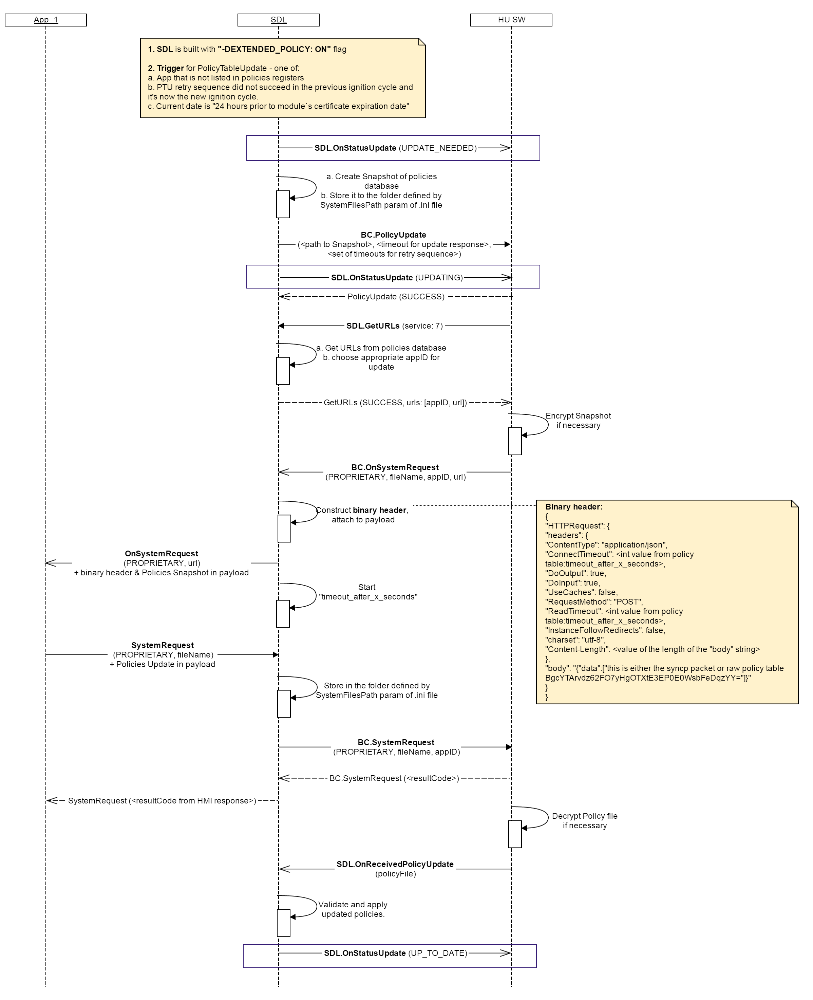

## OnStatusUpdate

Type
: Notification

Sender
: SDL

Purpose
: Inform the HMI about the status of a Policy Table Update (PTU).

### Notification

!!! may

Inform the User about the status of PTU by updating the appropriate UI screens.

!!!

!!! note

SDL operates with the following PTU statuses:
* UPDATE_NEEDED - one of the triggers for PTU occurs (see [BC.PolicyUpdate](../../BasicCommunication/PolicyUpdate/index.md#Request))
* UPDATING - SDL starts the PTU flow by creating the Snapshot of Local Policy Table
* UP_TO_DATE - SDL merges the Updated Policy Table to the Local one

!!!

#### Parameters

|Name|Type|Mandatory|Additional|
|:---|:---|:--------|:---------|
|status|[Common.UpdateResult](../../common/enums/#updateresult)|true||

### Example Notification
```json
{
  "jsonrpc" : "2.0",
  "method" : "SDL.OnStatusUpdate",
  "params" :  
  {
    "status" : "UPDATE_NEEDED"
  }
}
```

### Sequence Diagrams
|||
SDL.OnStatusUpdate in "Proprietary" Policy Table Update Flow

|||
