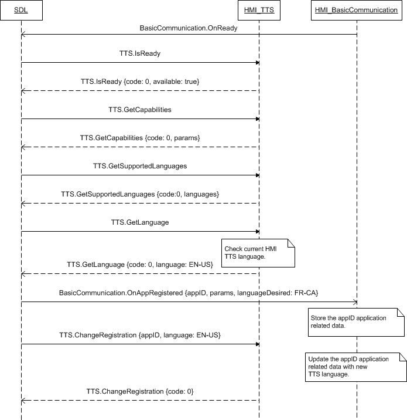

## ChangeRegistration

Type
: Function

Sender
: SDL

Purpose
: Change the language of the TTS component.

### Request

#### Parameters

|Name|Type|Mandatory|Additional|Description|
|:---|:---|:--------|:---------|:--------------------------|
|ttsName|[Common.TTSChunk](../../common/structs/#ttschunk)|false|array, minsize="1" maxsize="100"|Request new ttsName registration<br>TTS string for VR recognition of the mobile application name, e.g. "Ford Drive Green".<br> Meant to overcome any failing on speech engine in properly pronouncing / understanding app name.<br>May not be empty.<br>May not start with a new line character.<br>Not unique value (SDL makes all the checks)|
|language|[Common.Language](../../common/enums/#language)|true| | |
|appID|Integer|true| | |

### Response

#### Parameters

This RPC has no additional parameter requirements

### Sequence Diagrams
|||
ChangeRegistration after OnAppRegistered

|||

### Example Request

```json
{
  "id" : 206,
  "jsonrpc" : "2.0",
  "method" : "TTS.ChangeRegistration",
  "params" :
  {
    "language" : "DE-DE",
    "appID" : 65539
  }
}
```
### Example Response

```json
{
  "id" : 206,
  "jsonrpc" : "2.0",
  "result" :
  {
    "code" : 0,
    "method" : "TTS.ChangeRegistration"
  }
}
```

### Example Error

```json
{
  "id" : 206,
  "jsonrpc" : "2.0",
  "error" :
  {
    "code" : 22,
    "message" : "Unknown error occurred",
    "data" :
    {
      "method" : "TTS.ChangeRegistration"
    }
  }
}
```
