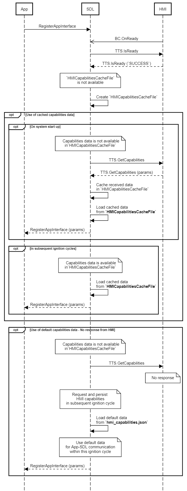

## GetCapabilities

Type
: Function

Sender
: SDL

Purpose
: Inform SDL of the TTS capabilities of the vehicle.

### Request

#### Parameters

|Name|Type|Mandatory|Additional|Description|
|:---|:---|:--------|:---------|:----------|

### Response

#### Parameters

|Name|Type|Mandatory|Additional|Description|
|:---|:---|:--------|:---------|:----------|
|speechCapabilities|Common.SpeechCapabilities|true|array: true<br>minsize: 1<br>maxsize: 5||
|prerecordedSpeechCapabilities|Common.PrerecordedSpeech|true|array: true<br>minsize: 1<br>maxsize: 5||

#### SpeechCapabilities

|Name|Value|
|:---|:----|
|TEXT|0|
|SAPI_PHONEMES|1|
|LHPLUS_PHONEMES|2|
|PRE_RECORDED|3|
|SILENCE|4|

#### PrerecordedSpeech

|Name|Value|
|:---|:----|
|HELP_JINGLE|0|
|INITIAL_JINGLE|1|
|LISTEN_JINGLE|2|
|POSITIVE_JINGLE|3|
|NEGATIVE_JINGLE|4|

### Sequence Diagrams
|||
GetCapabilities

|||

### Example Request

```json
{
	"id" : 13,
	"jsonrpc" : "2.0",
	"method" : "TTS.GetCapabilities"
}
```
### Example Response

```json
{
	"id" : 13,
	"jsonrpc" : "2.0",
	"result" :
	{
		"capabilities" : [TEXT],
		"prerecordedSpeechCapabilities" : [HELP_JINGLE, INITIAL_JINGLE, LISTEN_JINGLE, POSITIVE_JINGLE, NEGATIVE_JINGLE],
		"code" : 0,
		"method" : "TTS.GetCapabilities"
	}
}
```

### Example Error

```json
{
	"id" : 28,
	"jsonrpc" : "2.0",
	"error" :
	{
		"code" : 11,
		"message" : "The data sent is invalid",
		"data" :
		{
			"method" : "TTS.GetCapabilities"
		}
	}
}
```
