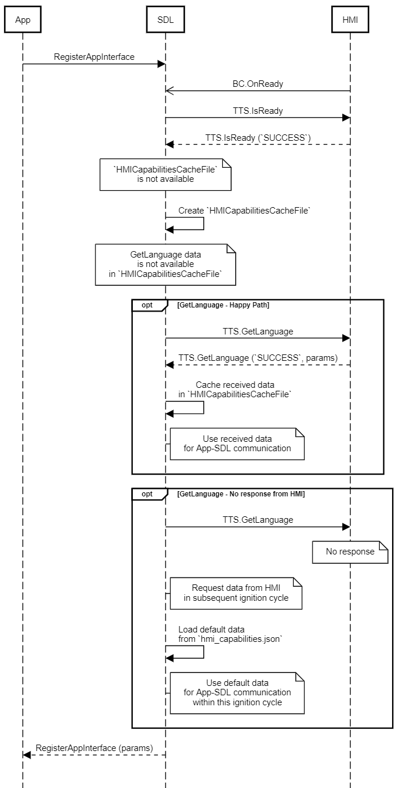

## GetLanguage

Type
: Function

Sender
: SDL

Purpose
: Get the current <abbr title="Text To Speech">TTS</abbr> language.

### Request

#### Parameters

This RPC has no additional parameter requirements

### Response

#### Parameters

|Name|Type|Mandatory|Additional|
|:---|:---|:--------|:---------|
|language|[Common.Language](../../common/enums/#language)|true||

### Sequence Diagrams

|||
GetLanguage  

|||

### JSON Message Examples

#### Example Request

```json
{
  "id" : 110,
  "jsonrpc" : "2.0",
  "method" : "TTS.GetLanguage"
}
```

#### Example Response

```json
{
  "id" : 110,
  "jsonrpc" : "2.0",
  "result" :
  {
    "language" : "DE-DE",
    "code" : 0,
    "method" : "TTS.GetLanguage"
  }
}
```

#### Example Error

```json
{
  "id" : 110,
  "jsonrpc" : "2.0",
  "error" :
  {
    "code" : 22,
    "message" : "During the API call the unknown error has occurred",
    "data" :
    {
      "method" : "TTS.GetLanguage"
    }
  }
}
```
