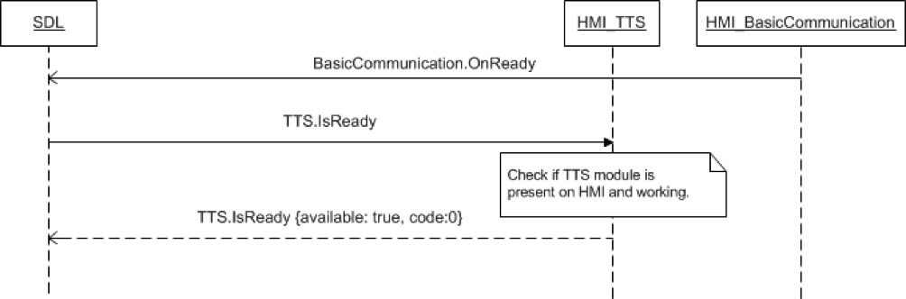

## IsReady


### Request

#### Parameters

|Name|Type|Mandatory|Additional|Description|
|:---|:---|:--------|:---------|:----------|

### Response

#### Parameters

|Name|Type|Mandatory|Additional|Description|
|:---|:---|:--------|:---------|:----------|
|available|Boolean|true|||

### Sequence Diagrams
|||
IsReady

|||

### Example Request

```json
{
	"id" : 45,
	"jsonrpc" : "2.0",
	"method" : "TTS.IsReady"
}
```
### Example Response

```json
{
	"id" : 45,
	"jsonrpc" : "2.0",
	"result" :
	{
		"available" : true,
		"code" : 0,
		"method" : "TTS.IsReady"
	}
}
```

### Example Error

```json
{
	"id" : 45,
	"jsonrpc" : "2.0",
	"error" :
	{
		"code" : 11,
		"message" : "Invalid data",
		"data" :
		{
			"method" : "TTS.IsReady"
		}
	}
}
```
