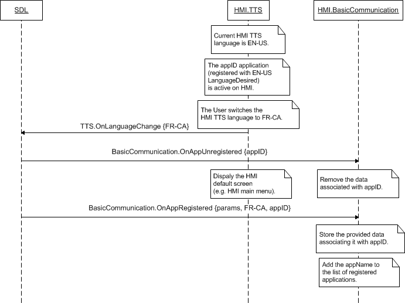

## OnLanguageChange

Type
: Notification

Sender
: HMI

Purpose
: Inform SDL that the language for the TTS component has changed.

### Notification

#### Parameters

|Name|Type|Mandatory|Additional|
|:---|:---|:--------|:---------|
|language|[Common.Language](../../Common/Enums/index.md#language)|true||

### Sequence Diagrams
|||
OnLanguageChange

|||

#### JSON Example Notification
```json
{
	"jsonrpc" : "2.0",
	"method" : "TTS.OnLanguageChange",
	"params" :
	{
		"language" : "IT-IT"
	}
}
```
