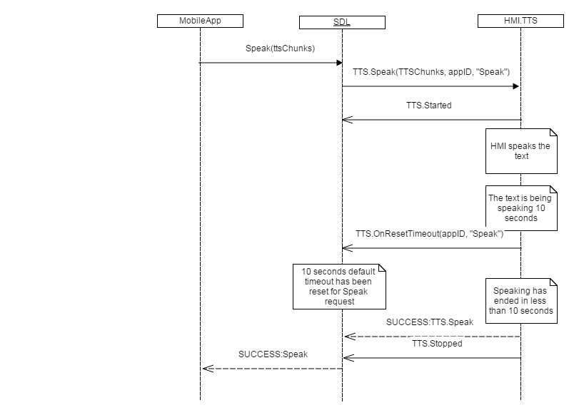
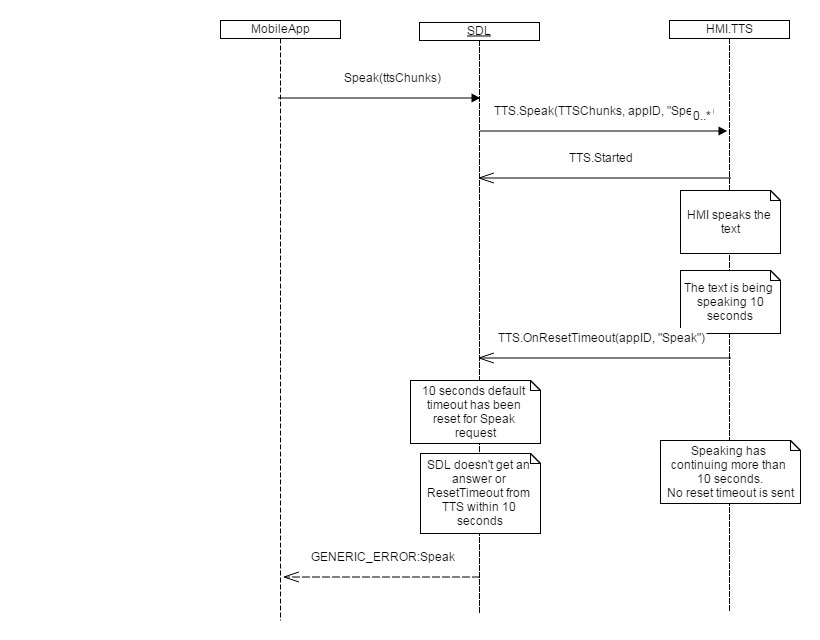

## OnResetTimeout

### Notification

#### Parameters

|Name|Type|Mandatory|Additional|Description|
|:---|:---|:--------|:---------|:----------|
|appID|Integer|true|||
|methodName|String|true|||

### Sequence Diagrams
|||
OnResetTimeout for Speak SUCCESS

|||
|||
OnResetTimeout for Speak GENERIC_ERROR

|||
