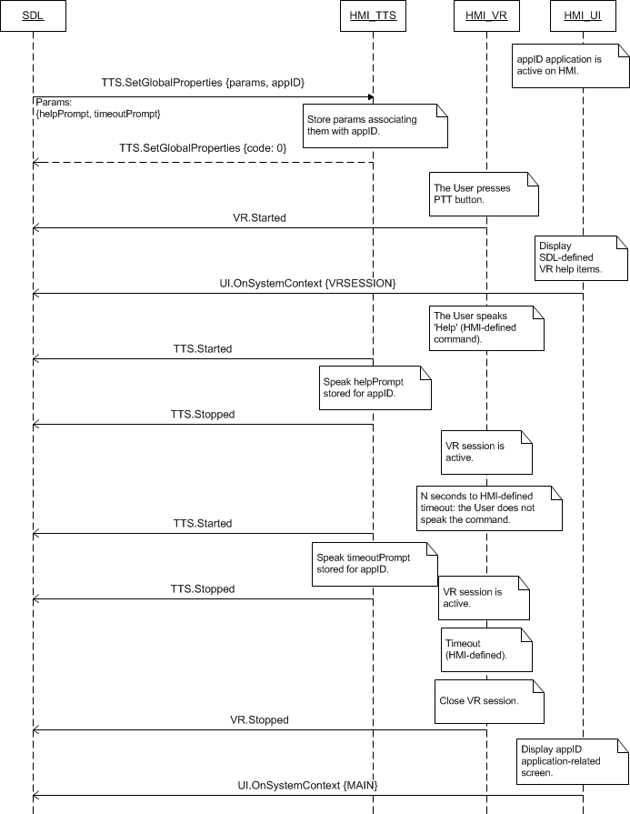

## SetGlobalProperties

Type
: Function

Sender
: SDL

Purpose
: Set the properties for the TTS component.

### Request

#### Parameters

|Name|Type|Mandatory|Additional|Description|
|:---|:---|:--------|:---------|:----------|
|helpPrompt|Common.TTSChunk|false|array: true<br>minsize: 0<br>maxsize: 100||
|timeoutPrompt|Common.TTSChunk|false|array: true<br>minsize: 1<br>maxsize: 100||
|appID|Integer|true|||

#### TTSChunk

|Name|Type|Mandatory|Additional|Description|
|:---|:---|:--------|:---------|:----------|
|text|String|true|maxlength: 500||
|type|Common.SpeechCapabilities|true|||

#### TTSChunk

|Name|Type|Mandatory|Additional|Description|
|:---|:---|:--------|:---------|:----------|
|text|String|true|maxlength: 500||
|type|Common.SpeechCapabilities|true|||

### Response

#### Parameters

This RPC has no additional parameter requirements

### Sequence Diagrams
|||
SetGlobalProperties

|||

### Example Request

```json
{
	"id" : 37,
	"jsonrpc" : "2.0",
	"method" : "TTS.SetGlobalProperties",
	"params" :
	{
		"helpPrompt" :
		[
			"text" : "Yes",
			"text" : "No",
			"text" : "Skip"
		],

		"timeoutPrompt" :
		[
			"text" : "Please make a choice",
			"text" : "The time is about to expire"
		],
		"appID" : 65542
	}
}
```
### Example Response

```json
{
	"id" : 37,
	"jsonrpc" : "2.0",
	"result" :
	{
		"code" : 0,
		"method" : "TTS.SetGlobalProperties"
	}
}
```

### Example Error

```json
{
	"id" : 37,
	"jsonrpc" : "2.0",
	"error" :
	{
		"code" : 2,
		"message" : "TTS is not supported",
		"data" :
		{
			"method" : "TTS.SetGlobalProperties"
		}
	}
}
```
