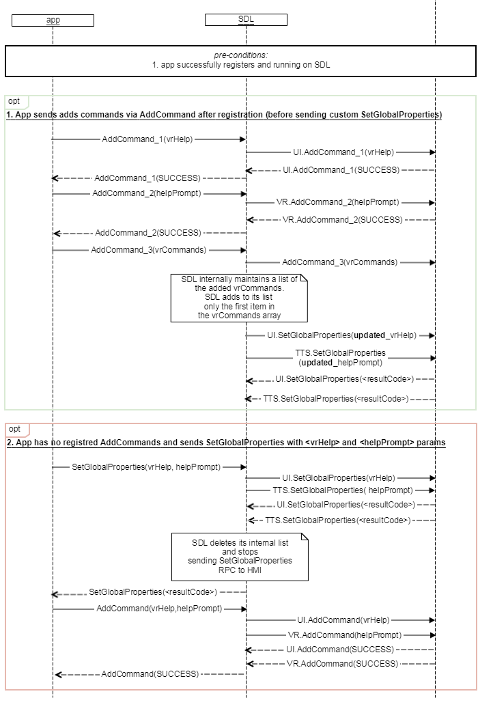

## SetGlobalProperties

Type
: Function

Sender
: SDL

Purpose
: Set the properties for the TTS component.

### Description

SDL requests to set the values for the prompts to be spoken by TTS during the User's interaction with the application over head unit.

### Request

On receiving `AddCommand` with `CommandType = Command` before a custom `helpPrompt` is set by the application, SDL must send updated values of `helpPrompt` via TTS.SetGlobalProperties request to HMI.

#### Parameters

|Name|Type|Mandatory|Additional|
|:---|:---|:--------|:---------|
|helpPrompt|[Common.TTSChunk](../../common/structs/#ttschunk)|false|array: true<br>minsize: 0<br>maxsize: 100|
|timeoutPrompt|[Common.TTSChunk](../../common/structs/#ttschunk)|false|array: true<br>minsize: 1<br>maxsize: 100|
|appID|Integer|true||

### Response

#### Parameters

This RPC has no additional parameter requirements

### Sequence Diagrams

|||
SetGlobalProperties

|||

|||
SetGlobalProperties request with VRHelp and HelpPrompt params

|||

### JSON Message Examples

#### Example Request

```json
{
  "id" : 37,
  "jsonrpc" : "2.0",
  "method" : "TTS.SetGlobalProperties",
  "params" :
  {
    "helpPrompt" :
    [
      {
        "text" : "Yes", 
        "type" : "TEXT"
      },
      {
        "text" : "No", 
        "type" : "TEXT"
      },
      {
        "text" : "Skip", 
        "type" : "TEXT"
      }
    ],

    "timeoutPrompt" :
    [
      {
        "text" : "Please make a choice", 
        "type" : "TEXT"
      },
      {
        "text" : "The time is about to expire", 
        "type" : "TEXT"
      }
    ],
    "appID" : 65542
  }
}
```

#### Example Response

```json
{
  "id" : 37,
  "jsonrpc" : "2.0",
  "result" :
  {
    "code" : 0,
    "method" : "TTS.SetGlobalProperties"
  }
}
```

#### Example Error

```json
{
  "id" : 37,
  "jsonrpc" : "2.0",
  "error" :
  {
    "code" : 2,
    "message" : "TTS is not supported",
    "data" :
    {
      "method" : "TTS.SetGlobalProperties"
    }
  }
}
```
