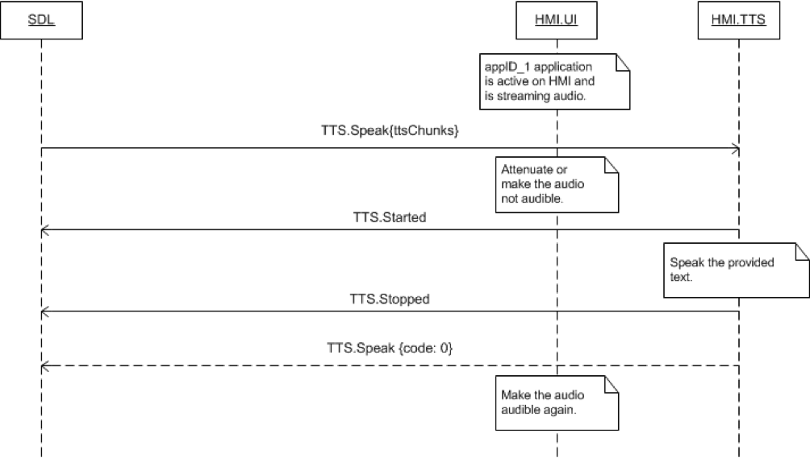

## Speak


### Request

#### Parameters

|Name|Type|Mandatory|Additional|Description|
|:---|:---|:--------|:---------|:----------|
|ttsChunks|Common.TTSChunk|true|array: true<br>minsize: 1<br>maxsize: 100||
|appID|Integer|true|||
|speakType|Common.MethodName|false|||

#### TTSChunk

|Name|Type|Mandatory|Additional|Description|
|:---|:---|:--------|:---------|:----------|
|text|String|true|maxlength: 500||
|type|Common.SpeechCapabilities|true|||

#### MethodName

|Name|Value|
|:---|:----|
|ALERT|0|
|SPEAK|1|
|AUDIO_PASS_THRU|2|
|ALERT_MANEUVER|3|

### Sequence Diagrams
|||
Speak

|||

### Example Request

```json

```
### Example Response

```json

```

### Example Error

```json

```
