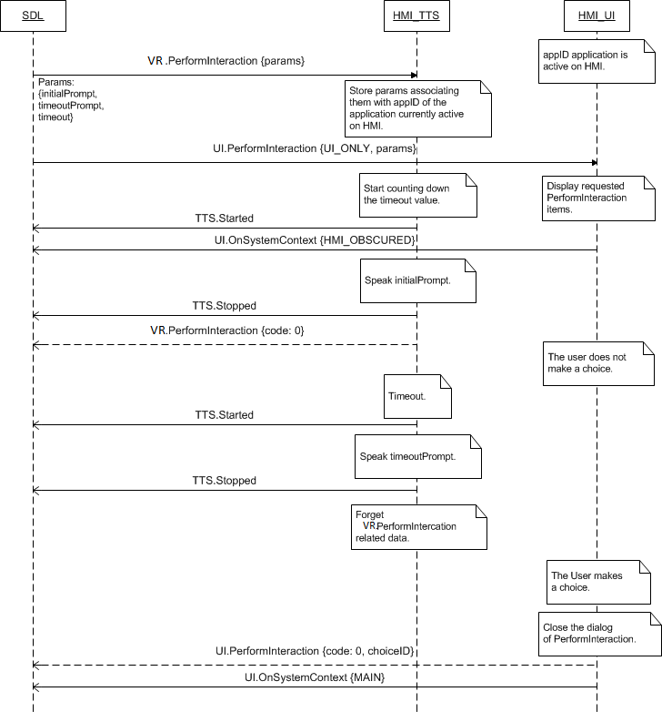

## Started


### Notification

### Sequence Diagrams
|||
Started upon TTS.Speak request from SDL

|||
|||
Started during PerformInteraction

|||

### Example Request

```json

```
### Example Response

```json

```

### Example Error

```json

```
