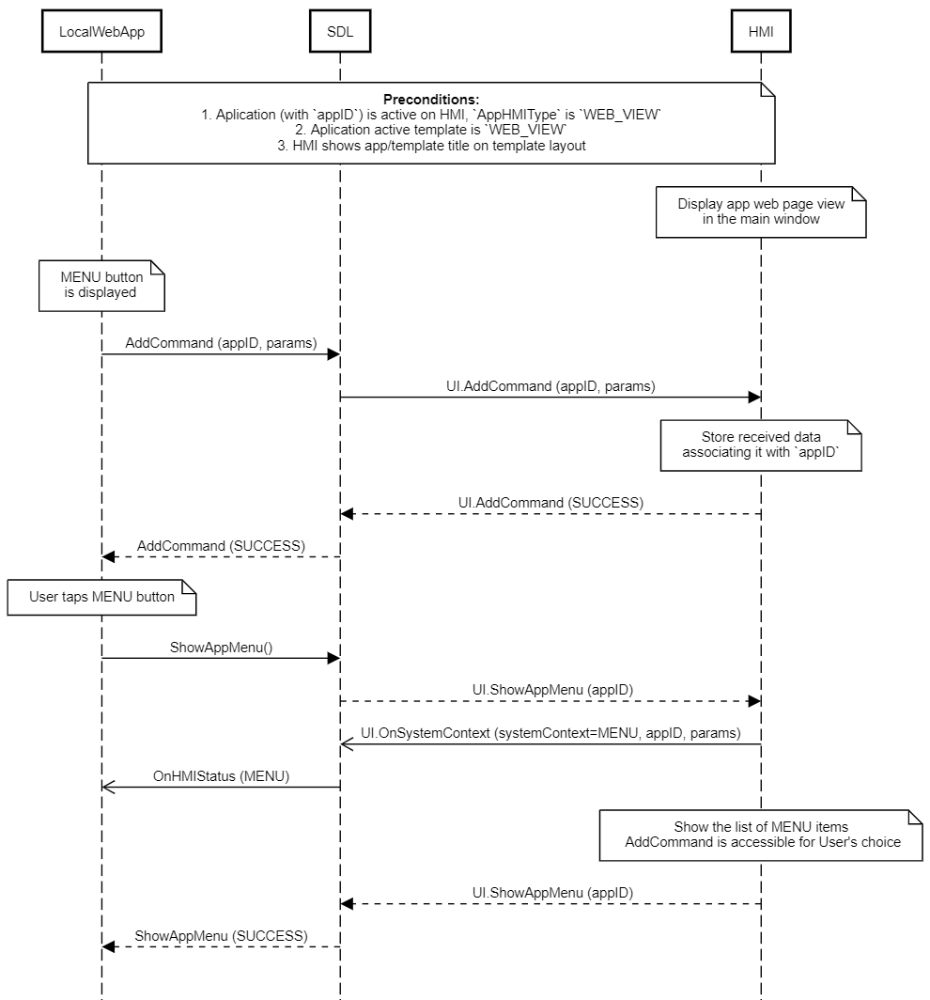

## AddCommand

Type
: Function

Sender
: SDL

Purpose
: Add a command to the specified application's menu or sub menu

UI.AddCommand represents a request from an application to add a command to the application's menu or sub-menu. This RPC can be sent to the HMI for an application that is registered and in any state (FULL, BACKGROUND, etc.)

!!! must

  1. The commands sent for the application via AddCommand must be accessible from a Menu
  2. The user must be able to enter the Menu while the related application is in the FULL state
  3. Store the data provided in this RPC with the requesting application's appID
  4. Add the command to the application's menu at the position specified in the `menuParams`
  5. If driver distraction state is enabled, the number of shown items should be limited by the driver distraction system capability parameter [menuLength](../../common/struct/#driverdistractioncapability)

!!!

!!! note

  * If SDL sends the HMI a UI.AddCommand and a VR.AddCommand, and receives a SUCCESS from one and a failure from the other, SDL will send a UI.DeleteCommand for the AddCommand which succeeded.
  * If the `menuParams` contains a `parentID`, the command is part of a sub menu. SDL adds new sub menus via the [UI.AddSubMenu](../addsubmenu) request.
  * If some command list items are hidden due to driver distraction, the HMI can note that some menu items are hidden for the drivers safety.
  * If the `menuParams` contains a `parentID` the command is part of a sub menu. SDL adds SubMenu Commands to the top level Menu via [UI.AddSubMenu](../addsubmenu)
  * During data resumption SDL sends UI.AddCommands to HMI by `internal_consecutiveNumber` in the same order as they were created by mobile app in previous ignition cycle.

!!!

### Request

#### Parameters

|Name|Type|Mandatory|Additional|
|:---|:---|:--------|:---------|
|cmdID|Integer|true|minvalue: 0<br>maxvalue: 2000000000|
|menuParams|[Common.MenuParams](../../common/structs/#menuparams)|false||
|cmdIcon|[Common.Image](../../common/structs/#image)|false||
|appID|Integer|true||

### Response

#### Parameters

This RPC has no additional parameter requirements

### Sequence Diagrams

|||
AddCommand Command Chosen By User

|||

|||
AddCommand App Inactive

|||

|||
AddCommand with sub menu

|||

|||
AddCommand positions

|||

|||
AddCommand Rejected Limit Reached

|||

|||
AddCommand UI Succeeds, <abbr title="Voice Recognition">VR</abbr> Fails

|||

|||
AddCommand UI Succeeds, <abbr title="Voice Recognition">VR</abbr> Unresponsive

|||

|||
AddCommand UI Fails, <abbr title="Voice Recognition">VR</abbr> Succeeds

|||

|||
AddCommand UI No Response, <abbr title="Voice Recognition">VR</abbr> Succeeds

|||

|||
AddCommand for WebEngine App

|||

AddCommand restoring during data resumption

|||

### JSON Message Examples

#### Example Request

```json
{
  "id" : 215,
  "jsonrpc" : "2.0",
  "method" : "UI.AddCommand",
  "params" :
  {
    "cmdID" : 2318,
    "menuParams" :
     {
         "parentID" : 6,
         "position" : 0,
         "menuName" : "Show weather for tomorrow"
     },
    "cmdIcon" :
     {
         "value" : "tmp/SDL/app/Gis_meteo/1245_28.jpeg",
         "imageType" : "DYNAMIC"
     },
    "appID" : 65409
  }
}
```

#### Example Response

```json
{
  "id" : 215,
  "jsonrpc" : "2.0",
  "result" :
  {
    "code" : 0,
    "method" : "UI.AddCommand"
  }
}
```

#### Example Error

```json
{
  "id" : 215,
  "jsonrpc" : "2.0",
  "error" :
  {
    "code" : 13,
    "message" : "There’s no app with received appID registered",
    "data" :
    {
      "method" : "UI.AddCommand"
    }
  }
}
```
