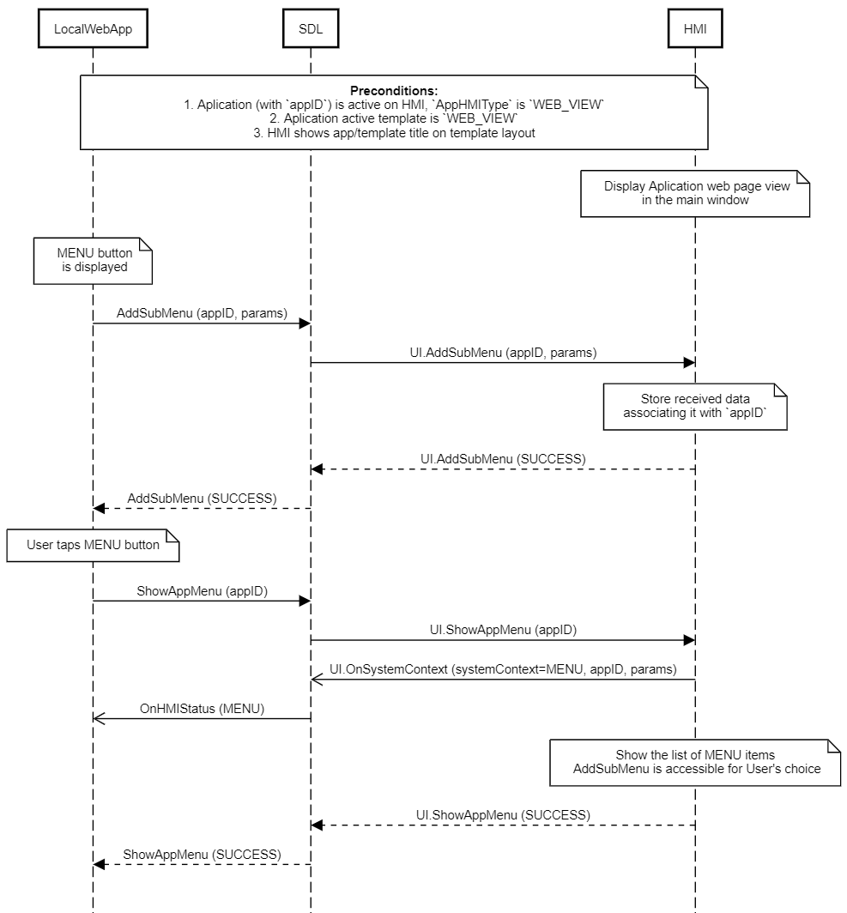

## AddSubMenu

Type
: Function

Sender
: SDL

Purpose
: Add a sub menu to the specified application's menu

UI.AddSubMenu represents a request from an application to add a sub-menu to the application's menu. This RPC can be sent to the HMI for an application that is registered and in any state (FULL, BACKGROUND, etc.)

!!! must

  1. The sub menu sent for the application via AddCommand must be accessible from a Menu
  2. If the user selects a sub menu item from the application's menu, the HMI must display all commands added via [UI.AddCommand](../addcommand) which share a `menuParams.parentID` with the menu's `menuID`
  3. Store the data provided in this RPC with the requesting application's appID
  4. Persist the stored data for the duration of the ignition cycle
  5. Add the command to the application's menu at the position specified in the `menuParams`
  6. Display images on sub menus if provided by the application.
  7. Provide a WARNINGS information to the application that the SubMenu was added but no image was displayed.
  8. Scale the image to ensure it fits properly in the space allocated for the display of the image. If the image does not fit properly even after scaling, the HMI shall not display any image on the submenu.
  9. If a new submenu contains a parentID parameter, the new submenu must be nested inside the submenu specified by the parentID.
  10. When driver distraction state is enabled, submenus that are deeper than the [subMenuDepth](../../common/structs/#driverdistractioncapability) driver distraction limit must be disabled and inaccessible to the user.
!!!

!!! note

  * SDL can request that a submenu be added to another submenu if the parentID parameter is present in the request's menu parameters.
  * A parentID value of 0 indicates the submenu is part of the top level menu.
  * If subMenuDepth is 1, all submenus should be disabled during driver distraction, meaning that only the top level menu should be accessible.
  * HMI does not display any image in case the application does not provide an image for display on the sub menu.
  * HMI does not display any image in case the image referenced by the application for display on the submenu is invalid or is not available.
  * To remove an icon already sent, the app would have to delete the submenu and add it again without the icon.Otherwise, if the submenu is not deleted, another request with the same submenu id will be rejected.

!!!

As of Core 7.1, UI.AddSubMenu requests can contain all UI elements that were previously found in a Perform Interaction's Choice.

### Request

#### Parameters

|Name|Type|Mandatory|Additional|
|:---|:---|:--------|:---------|
|menuID|Integer|true|minvalue: 1<br>maxvalue: 2000000000|
|menuParams|[Common.MenuParams](../../common/structs/#menuparams)|true||
|menuIcon|[Common.Image](../../common/structs/#image)|false||
|secondaryImage|[Common.Image](../../common/structs/#image)|false||
|appID|Integer|true||
|menuLayout|[Common.MenuLayout](../../common/enums/#menulayout)|false||

### Response

#### Parameters

This RPC has no additional parameter requirements

### Sequence Diagrams

|||
Add Sub Menu for Active App

|||

|||
Add Sub Menu for Inactive App

|||

|||
Add Sub Menu with positions

|||

|||
Add Sub Menu Rejected Limit Reached

|||

|||
Add Sub Menu for WebEngine App

|||

### JSON Message Examples

#### Example Request

```json
{
  "id" : 112,
  "jsonrpc" : "2.0",
  "method" : "UI.AddSubMenu",
  "params" :
  {
    "menuID" : 345,
    "menuParams" :
    {
         "position" : 2,
         "menuName" : "Settings",
         "secondaryText" : "General",
         "tertiaryText" : "Help"
    },
    "menuIcon" :
    {
         "value" : "tmp/SDL/app/Gis_meteo/1245_28.jpeg",
         "imageType" : "DYNAMIC"
    },
    "secondaryImage" :
    {
         "value" : "tmp/SDL/app/Gis_meteo/5678.jpeg",
         "imageType" : "DYNAMIC"
    },
    "appID" : 65464
  }
}
```

#### Example Response

```json
{
  "id" : 112,
  "jsonrpc" : "2.0",
  "result" :
  {
    "code" : 0,
    "method" : "UI.AddSubMenu"
  }
}
```

#### Example Error

```json
{
  "id" : 112,
  "jsonrpc" : "2.0",
  "error" :
  {
    "code" : 14,
    "message" : "Duplicate name: there was a conflict with an already registered name of SubMenu",
    "data" :
    {
      "method" : "UI.AddSubMenu"
    }
  }
}
```
