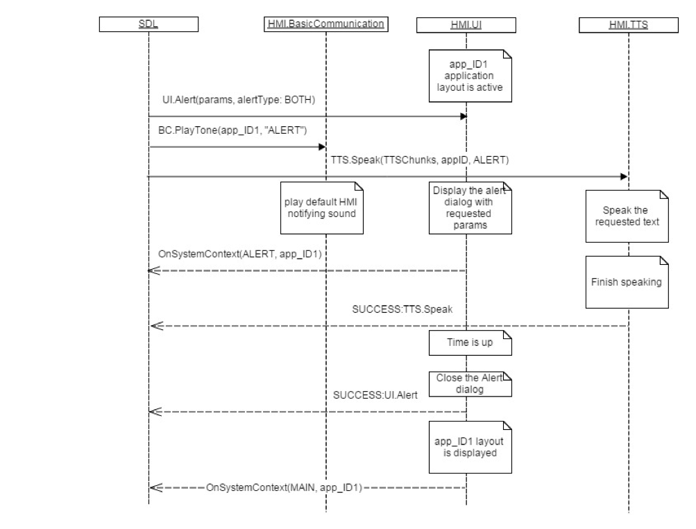

## Alert


### Request

#### Parameters

|Name|Type|Mandatory|Additional|Description|
|:---|:---|:--------|:---------|:----------|
|alertStrings|Common.TextFieldStruct|true|array: true<br>minsize: 0<br>maxsize: 3||
|duration|Integer|true|minvalue: 3000<br>maxvalue: 10000||
|softButtons|Common.SoftButton|false|array: true<br>minsize: 0<br>maxsize: 4||
|progressIndicator|Boolean|false|||
|alertType|Common.AlertType|true|||
|appID|Integer|true|||

#### TextFieldStruct

|Name|Type|Mandatory|Additional|Description|
|:---|:---|:--------|:---------|:----------|
|fieldName|Common.TextFieldName|true|||
|fieldText|String|true|maxlength: 500||

#### SoftButton

|Name|Type|Mandatory|Additional|Description|
|:---|:---|:--------|:---------|:----------|
|type|Common.SoftButtonType|true|||
|text|String|false|maxlength: 500||
|image|Common.Image|false|||
|isHighlighted|Boolean|false|||
|softButtonID|Integer|true|minvalue: 0<br>maxvalue: 65535||
|systemAction|Common.SystemAction|true|||

#### AlertType

|Name|Value|
|:---|:----|
|UI|0|
|BOTH|1|

### Response

#### Parameters

|Name|Type|Mandatory|Additional|Description|
|:---|:---|:--------|:---------|:----------|
|tryAgainTime|Integer|false|minvalue: 0<br>maxvalue: 2000000000||

### Sequence Diagrams
|||
Alert with PlayTone and Speak

|||
|||
Alert closed by DEFAULT_ACTION

|||
|||
Alert closed by STEAL_FOCUS

|||
|||
Alert Aborted by VR Session

|||
|||
Alert Rejected

|||
|||
Alert BOTH UI Closed before TTS finishes Speaking

|||

### Example Request

```json
{
	"id" : 92,
	"jsonrpc" : "2.0",
	"method" : "UI. Alert",
	"params" :
	{
		"alertStrings" :
		[
			{
				 "fieldName" : alertText1,
				 "fieldText" : "WARNING"
			},
			{
				 "fieldName" : alertText2,
				 "fieldText" : "Hard weather conditions"
			}
		],
		"duration" : 5000,
		"softButtons" :
		{
			"type" : TEXT,
			"text" : "OK",
			"softButtonID" : 697,
			"systemAction" : DEFAULT_ACTION
		},
      "alertType": "BOTH",
		"appID" : 65539
	}
}
```
### Example Response

```json
{
	"id" : 92,
	"jsonrpc" : "2.0",
	"result" :
	{
		"code" : 0,
		"method" : "UI.Alert"
	}
}
```

### Example Error

```json
{
	"id" : 92,
	"jsonrpc" : "2.0",
	"error" :
	{
		"code" : 4,
		"message" : "The requested command was rejected.",
		"data" :
		{
			"tryAgainTime" : 10000,
			"method" : "UI.Alert"
		}
	}
}
```
