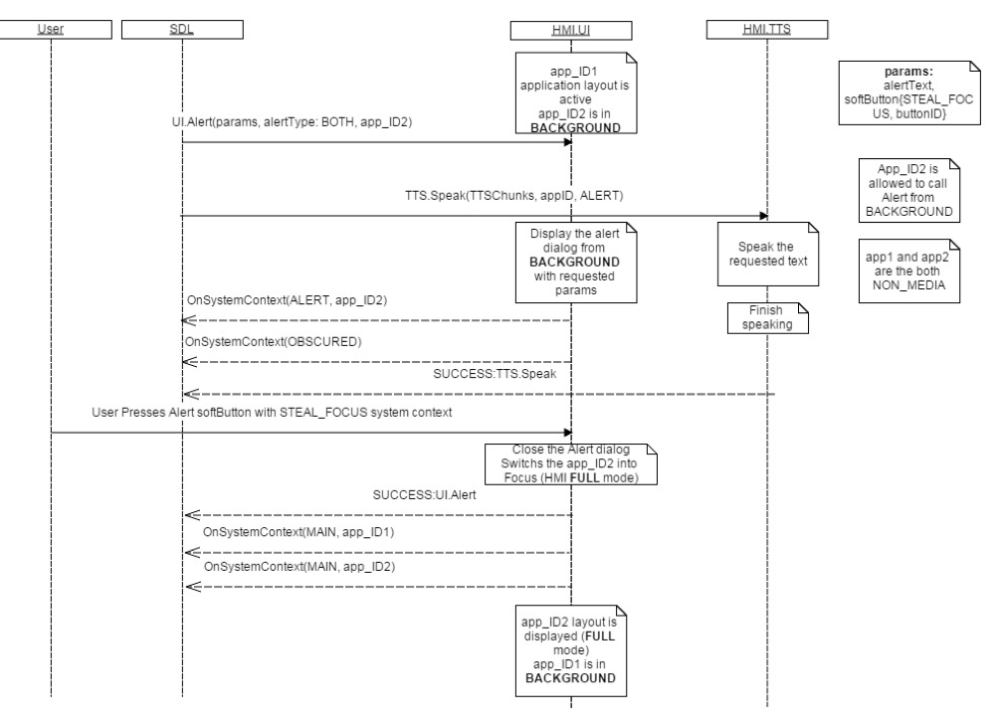
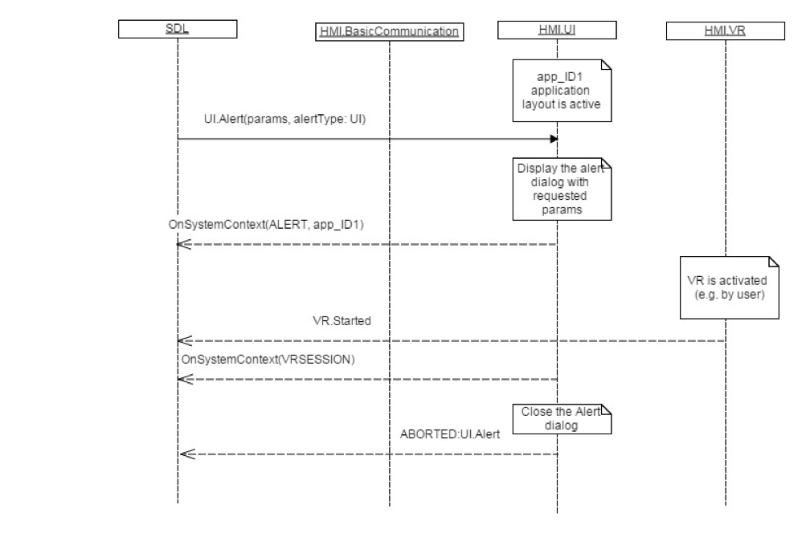
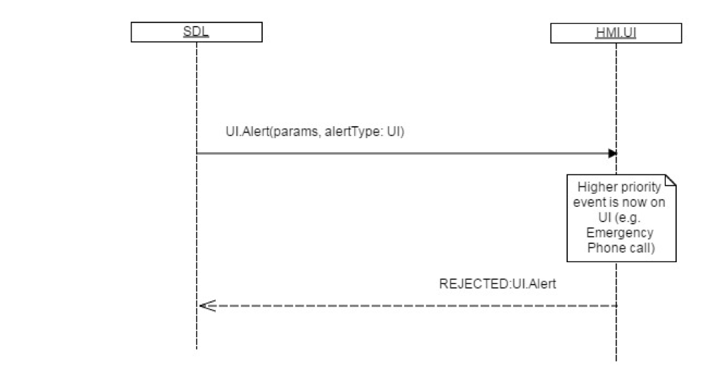
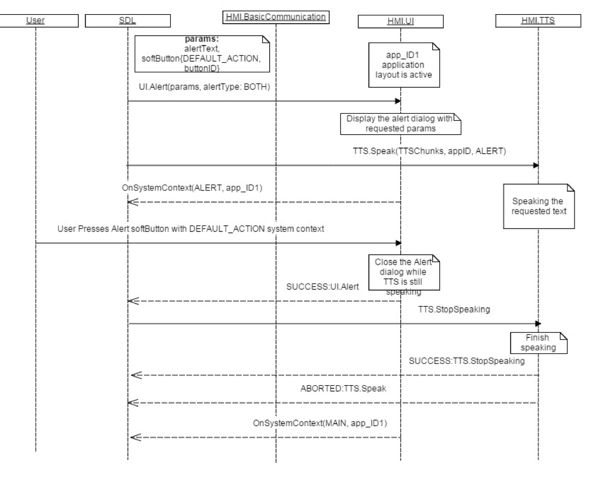

## Alert

Type
: Function

Sender
: SDL

Purpose
: Display an alert message on the HMI

SDL sends the `UI.Alert` RPC when some information needs to be displayed to the user on a display. The Alert has a `softButtons` array of buttons which the user can use to take action on the alert.

!!! must

  1. If the alert includes a soft button of type `STEAL_FOCUS` and the user presses the button, the HMI must bring the app associated with the Alert into full screen mode.
  2. The HMI must send [UI.OnSystemContext](../onsystemcontext) with type `ALERT` for the application which is in `FULL` mode.
  3. Respond to the Alert earlier than SDL's default timeout of 10 seconds - applicable only to alerts without `softButtons`.
  4. Display the alert dialog with the text information in the `alertFields` array and optional `softButtons` and optional `displayIndicator` indicating a timeout for the alert
  5. Send [Buttons.OnButtonPress](../../buttons/onbuttonpress) and/or [Buttons.OnButtonEvent](../../buttons/onbuttonevent) notifications if soft buttons associated with the alert are pressed by the user
  6. Dismiss the alert after the duration has passed since receipt of the request

!!!

!!! may

The HMI may provide the user with a system defined "close" button providing the user with the possibility to dismiss the alert. In this case the HMI must still respond to the alert request

!!!

!!! note

An alert may be sent to the HMI for an application which is not currently active. If the alert contains `softButtons` then the duration will be set to `0`

!!!

### Request

#### Parameters

|Name|Type|Mandatory|Additional|
|:---|:---|:--------|:---------|
|alertStrings|[Common.TextFieldStruct](../../common/structs/#textfieldstruct)|true|array: true<br>minsize: 0<br>maxsize: 3|
|duration|Integer|true|minvalue: 3000<br>maxvalue: 10000|
|softButtons|[Common.SoftButton](../../common/structs/#softbutton)|false|array: true<br>minsize: 0<br>maxsize: 4|
|progressIndicator|Boolean|false||
|alertType|[Common.AlertType](../../common/enums/#alerttype)|true||
|appID|Integer|true||
|cancelID|Integer|false||
|alertIcon|[Common.Image](../../common/structs/#image)|false||

### Response

#### Parameters

|Name|Type|Mandatory|Additional|
|:---|:---|:--------|:---------|
|tryAgainTime|Integer|false|minvalue: 0<br>maxvalue: 2000000000|

### Sequence Diagrams
|||
Alert closed by DEFAULT_ACTION

|||
|||
Alert closed by STEAL_FOCUS

|||
|||
Alert Aborted by VR Session

|||
|||
Alert Rejected

|||
|||
Alert BOTH UI Closed before TTS finishes Speaking

|||

### Example Request

```json
{
  "id" : 92,
  "jsonrpc" : "2.0",
  "method" : "UI. Alert",
  "params" :
  {
    "alertStrings" :
    [
      {
         "fieldName" : "alertText1",
         "fieldText" : "WARNING"
      },
      {
         "fieldName" : "alertText2",
         "fieldText" : "Hard weather conditions"
      }
    ],
    "duration" : 5000,
    "softButtons" :
    {
      "type" : "TEXT",
      "text" : "OK",
      "softButtonID" : 697,
      "systemAction" : "DEFAULT_ACTION"
    },
      "alertType": "BOTH",
    "appID" : 65539
  }
}
```
### Example Response

```json
{
  "id" : 92,
  "jsonrpc" : "2.0",
  "result" :
  {
    "code" : 0,
    "method" : "UI.Alert"
  }
}
```

### Example Error

```json
{
  "id" : 92,
  "jsonrpc" : "2.0",
  "error" :
  {
    "code" : 4,
    "message" : "The requested command was rejected.",
    "data" :
    {
      "tryAgainTime" : 10000,
      "method" : "UI.Alert"
    }
  }
}
```
