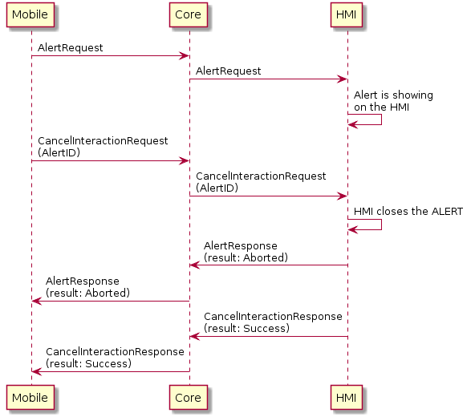
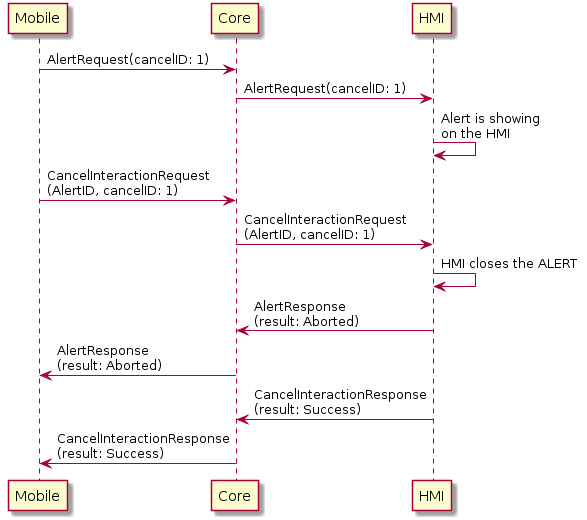

## CancelInteraction

Type
: Function

Sender
: SDL

Purpose
: Close an interaction of the specified type

### Request

#### Parameters

|Name|Type|Mandatory|Additional|
|:---|:---|:--------|:---------|
|appID|Integer|true||
|cancelID|Integer|false||
|functionID|Integer|true|Can be any one of AlertID, PerformInteractionID, SliderID or ScrollableMessageID|

### Sequence Diagrams
|||
CancelInteraction for any UI.Alert

|||

|||
CancelInteraction for specific UI.Alert using optional cancelID parameter

|||

### Example Request

```json
{
  "id" : 7408,
  "jsonrpc" : "2.0",
  "method" : "UI.CancelInteraction",
  "params" : {
    "appID" : 190838891,
    "cancelID" : -1,
    "functionID" : 12
  }
}
```
### Example Response

```json
{
  "id" : 7408,
  "jsonrpc" : "2.0",
  "result" :
  {
    "code" : 0,
    "method" : "UI.CancelInteraction"
  }
}
```

### Example Error

```json
{
  "id" : 7408,
  "jsonrpc" : "2.0",
  "error" :
  {
    "code" : 4,
    "message" : "Request is ignored, because the intended result is already in effect.",
    "data" : {
      "method" : "UI.CancelInteraction"
    }
  }
}
```
