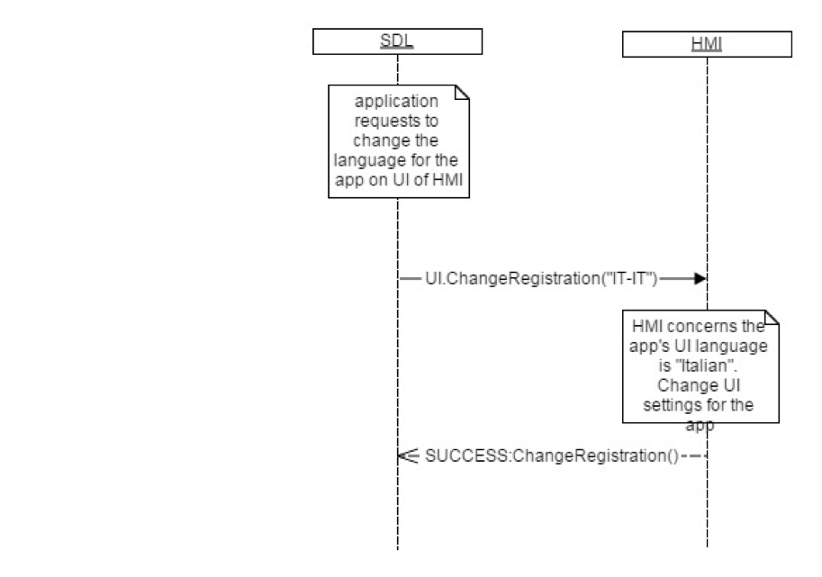

## ChangeRegistration

Type
: Function

Sender
: SDL

Purpose
: Change the display language for the specified application on the HMI

### Request

#### Parameters

|Name|Type|Mandatory|Additional|
|:---|:---|:--------|:---------|
|appName|String|false|maxlength: 100|
|ngnMediaScreenAppName|String|false|maxlength: 100|
|language|[Common.Language](../../common/enums/#language)|true||
|appHMIType|[Common.AppHMIType](../../common/enums/#apphmitype)|false|array: true<br>minsize: 1<br>maxsize: 100|
|appID|Integer|true||

### Response

#### Parameters

This RPC has no additional parameter requirements

### Sequence Diagrams
|||
ChangeRegistration

|||

### Example Request

```json
{
  "id" : 117,
  "jsonrpc" : "2.0",
  "method" : "UI.ChangeRegistration",
  "params" :
  {
    "Language" : "PT-PT",
    "appID" : 65146
  }
}
```

### Example Response

```json
{
  "id" : 117,
  "jsonrpc" : "2.0",
  "result" :
  {
    "code" : 0,
    "method" : "UI.ChangeRegistration"
  }
}
```

### Example Error

```json
{
  "id" : 117,
  "jsonrpc" : "2.0",
  "error" :
  {
    "code" : 11,
    "message" : "Invalid data",
    "data" :
    {
      "method" : "UI.ChangeRegistration"
    }
  }
}
```
