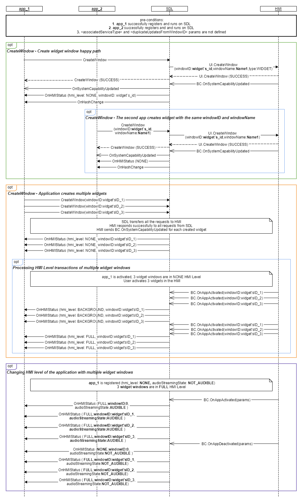

## CreateWindow

Type
: Function

Sender
: SDL

Purpose
: Create a new window on the display with the specified window type.

In order to work with widget windows, the app needs to be able to create them. One app can create one or multiple widgets.

This request is sent by SDL to HMI to create one or multiple widget windows.

!!! must
  1. Create and store a list of available widgets 
  2. Notify SDL about widget activation/deactivation
  3. Reject bidirectional window content duplication. Since widgets can be created with parameter `duplicateUpdatesFromWindowID`, it is prohibited for 2 widgets to have this parameter set to duplicate each other's content. (E.g. having widget1 that duplicates widget2 AND widget2 which duplicates widget1 is not allowed)

!!!

!!! may

  1. Present widgets (could be listed on the home window, in the app's domain of the system, or next to the main app window area)
  2. Hold widgets in a list of available widgets (so that a user can choose the widgets they want)
  3. Pre-create a primary widget associated with a service type, which would be used by the HMI whenever a single widget needs to represent the whole app.
  4. Duplicate the content from another widget or window 

!!!

### Request

#### Parameters

|Name|Type|Mandatory|Additional|
|:---|:---|:--------|:---------|
|windowID|Integer|true||
|windowName|String|true|maxlength: 100|
|type|[Common.WindowType](../../common/enums/#windowtype)|true||
|associatedServiceType|String|false||
|duplicateUpdatesFromWindowID|Integer|false||
|appID|Integer|true||

### Response

#### Parameters

This RPC has no additional parameter requirements

### Sequence Diagrams

|||
CreateWindow

|||

|||
Local Web App(WEB_VIEW) creates a widget that duplicates main window  

|||

### JSON Message Examples

#### Example Request

```json
{
  "id" : 70,
  "jsonrpc" : "2.0",
  "method" : "UI.CreateWindow",
  "params" :
  {
    "windowName":"Widget App1",
    "windowID":2,
    "associatedServiceType":"MEDIA",
    "type":"WIDGET",
    "duplicateUpdatesFromWindowID":0,
    "appID": 65368
  }
}
```

#### Example Response

```json
{
  "id" : 70,
  "jsonrpc" : "2.0",
  "result" :
  {
    "code" : 0,
    "method" : "UI.CreateWindow"
  }
}
```

#### Example Error

```json
{
  "id" : 70,
  "jsonrpc" : "2.0",
  "error" :
  {
    "code" : 8,
    "message" : "The data may not be changed because it is currently in use",
    "data" :
    {
    "method" : "UI.CreateWindow"
    }
  }
}
```
