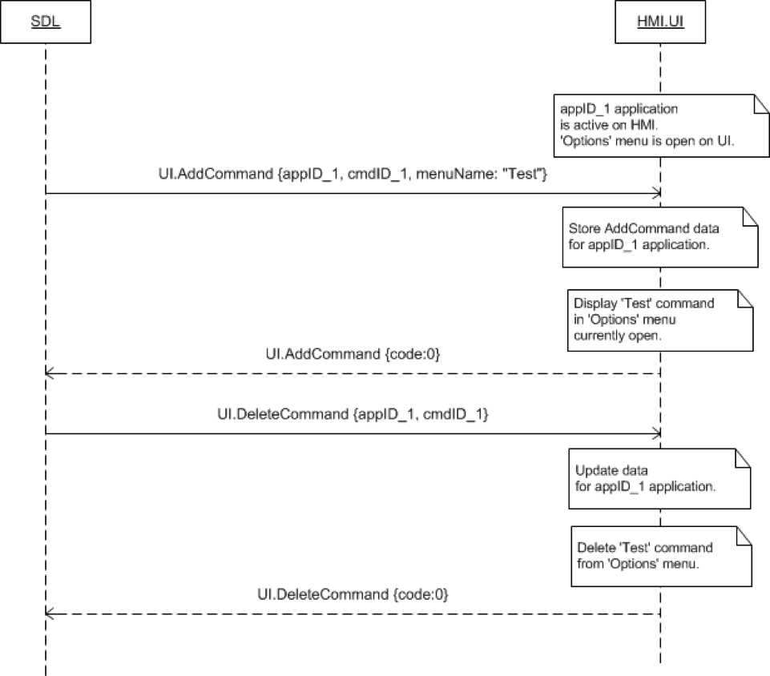
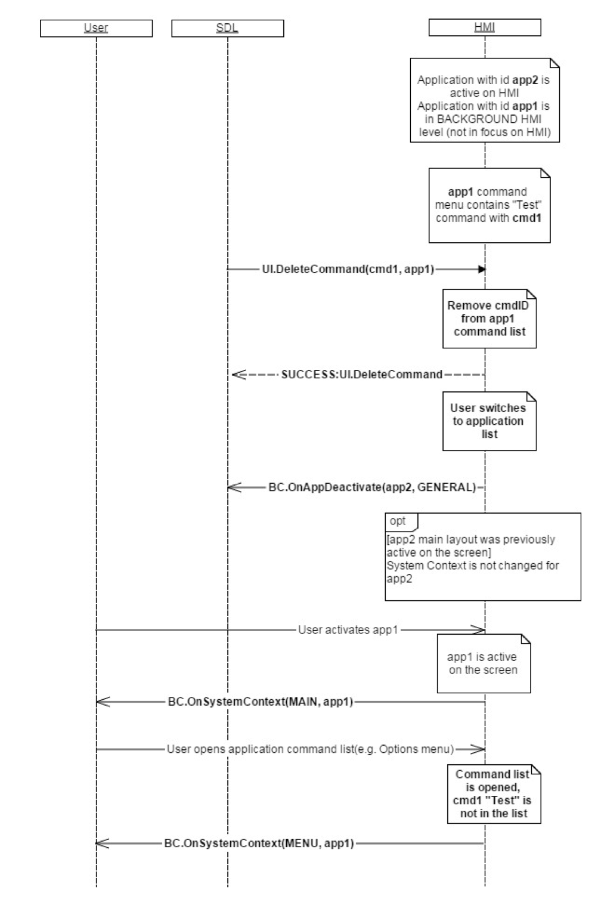

## DeleteCommand

Type
: Function

Sender
: SDL

Purpose
: Delete a command from the specified application's menu or submenu

UI.DeleteCommand represents a request to remove a previously added command (added via [UI.AddCommand](../addcommand)) from the application's menu.

!!! must

The application's menu must no longer display the command whose `cmdID` matches the RPC's `cmdID` when the user accesses the applications menu

!!!

### Request

#### Parameters

|Name|Type|Mandatory|Additional|
|:---|:---|:--------|:---------|
|cmdID|Integer|true|minvalue: 0<br>maxvalue: 2000000000|
|appID|Integer|true||

### Response

#### Parameters

This RPC has no additional parameter requirements

### Sequence Diagrams
|||
Delete Command with Menu Open

|||
|||
Delete Command Application Inactive

|||

### Example Request

```json
{
  "id" : 70,
  "jsonrpc" : "2.0",
  "method" : "UI. DeleteCommand",
  "params" :
  {
    "cmdID" : 2318,
    "appID" : 65409
  }
}
```
### Example Response

```json
{
  "id" : 70,
  "jsonrpc" : "2.0",
  "result" :
  {
    "code" : 0,
    "method" : "UI. DeleteCommand"
  }
}
```

### Example Error

```json
{
  "id" : 70,
  "jsonrpc" : "2.0",
  "error" :
  {
    "code" : 13,
    "message" : "One of the provided IDs is not valid",
    "data" :
    {
      "UI. DeleteCommand"
    }
  }
}
```
