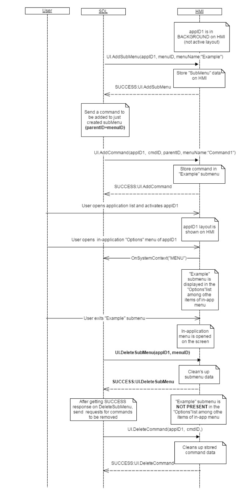

## DeleteSubMenu

Type
: Function

Sender
: SDL

Purpose
: Delete a sub menu from the specified application's menu

UI.DeleteSubMenu represents a request to remove a previously added sub menu (added via [UI.AddSubMenu](../addsubmenu)) from the application's menu.

!!! must

The application's menu must no longer display the sub menu whose `menuID` matches the RPC's `menuID` when the user accesses the applications menu

!!!

### Request

#### Parameters

|Name|Type|Mandatory|Additional|
|:---|:---|:--------|:---------|
|menuID|Integer|true|minvalue: 1<br>maxvalue: 2000000000|
|appID|Integer|true||

### Response

#### Parameters

This RPC has no additional parameter requirements

### Sequence Diagrams
|||
Delete Sub Menu Containing Commands

|||

### Example Request

```json
{
  "id" : 70,
  "jsonrpc" : "2.0",
  "method" : "UI.DeleteSubMenu",
  "params" :
  {
    "menuID" : 345,
    "appID" : 65464
  }
}
```

### Example Response

```json
{
  "id" : 70,
  "jsonrpc" : "2.0",
  "result" :
  {
    "code" : 0,
    "method" : "UI.DeleteSubMenu"
  }
}
```

### Example Error

```json
{
  "id" : 70,
  "jsonrpc" : "2.0",
  "error" :
  {
    "code" : 8,
    "message" : "The data may not be changed because it is currently in use",
    "data" :
    {
      "method": "UI.DeleteSubMenu"
    }
  }
}
```
