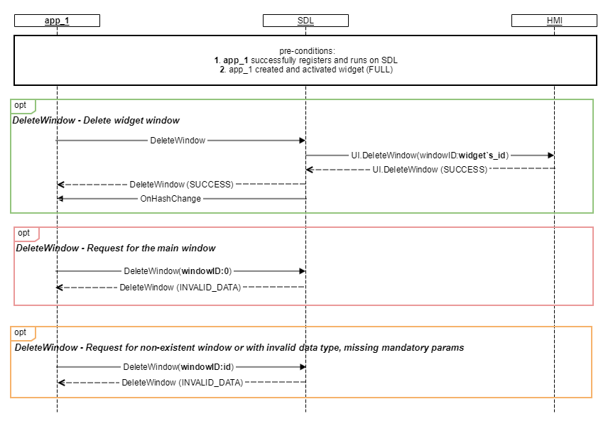

## DeleteWindow

Type
: Function

Sender
: SDL

Purpose
: Delete previously created window of the SDL application

In order to work with multiple widget windows, the app needs to be able to delete windows. 

!!! must

1. Delete requested window.
2. Not delete the default main window on the main display. 

!!!

### Request

#### Parameters

|Name|Type|Mandatory|Additional|
|:---|:---|:--------|:---------|
|windowID|Integer|true|The value of '0' will always be the default main window on the main display and cannot be deleted.|


### Response

#### Parameters
This RPC has no additional parameter requirements.


### Sequence Diagrams
|||
DeleteWindow

|||


### JSON Message Examples

#### Example Request

```json
{
  "id" : 70,
  "jsonrpc" : "2.0",
  "method" : "UI.DeleteWindow",
  "params" :
  {
    "windowID":2
  }
}
```

#### Example Response

```json
{
  "id" : 70,
  "jsonrpc" : "2.0",
  "result" :
  {
    "code" : 0,
    "method" : "UI.DeleteWindow"
  }
}
```

#### Example Error

```json
{
  "id" : 70,
  "jsonrpc" : "2.0",
  "error" :
  {
    "code" : 8,
    "message" : "The data may not be changed because it is currently in use",
    "data" :
    {
      "UI. DeleteWindow"
    }
  }
}
```
