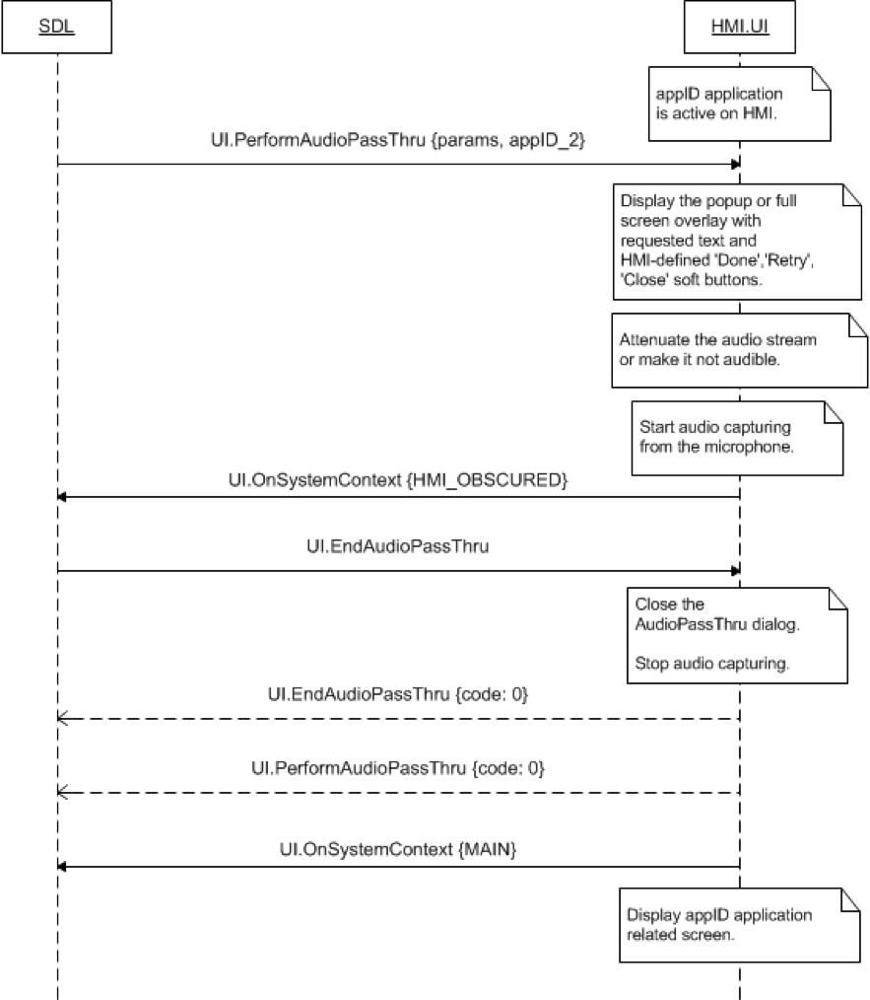
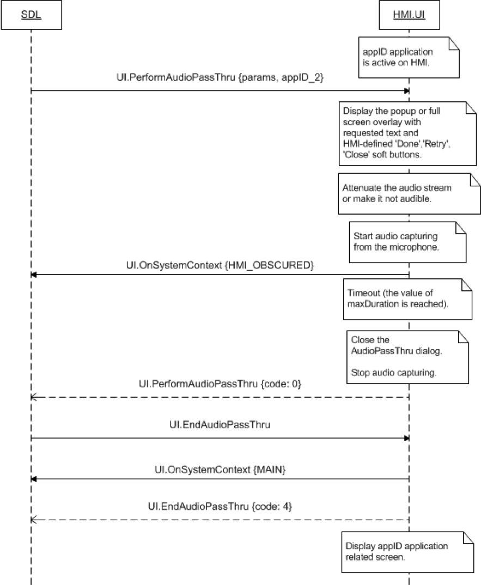

## EndAudioPassThru


### Request

#### Parameters

|Name|Type|Mandatory|Additional|Description|
|:---|:---|:--------|:---------|:----------|

### Response

#### Parameters

This RPC has no additional parameter requirements

### Sequence Diagrams
|||
EndAudioPassThru stops audio capturing

|||
|||
EndAudioPassThru audio capturing already ended

|||

### Example Request

```json

```
### Example Response

```json

```

### Example Error

```json

```
