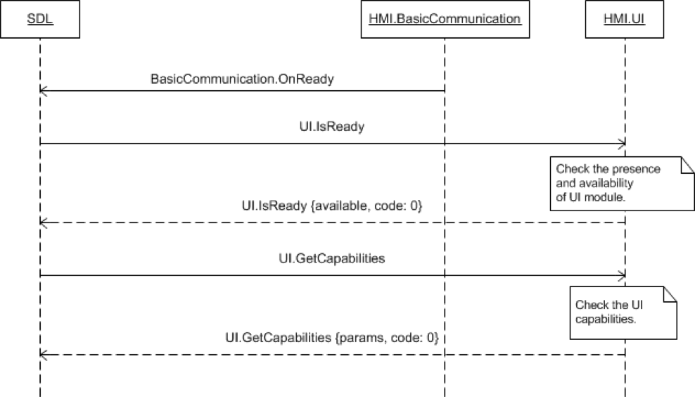

## GetCapabilities

Type
: Function

Sender
: SDL

Purpose
: Inform SDL of the UI capabilities of the vehicle.


### Request

#### Parameters

|Name|Type|Mandatory|Additional|
|:---|:---|:--------|:---------|

### Response

#### Parameters

|Name|Type|Mandatory|Additional|
|:---|:---|:--------|:---------|
|displayCapabilities|[Common.DisplayCapabilities](../../common/structs/#displaycapabilities)|true||
|audioPassThruCapabilities|[Common.AudioPassThruCapabilities](../../common/structs/#audiopassthrucapabilities)|true||
|audioPassThruCapabilitiesList|[Common.AudioPassThruCapabilities](../../common/structs/#audiopassthrucapabilities)|false|array: true<br>minsize: 1<br>maxsize: 100|
|hmiZoneCapabilities|[Common.HmiZoneCapabilities](../../common/enums/#hmizonecapabilities)|true||
|softButtonCapabilities|[Common.SoftButtonCapabilities](../../common/structs/#softbuttoncapabilities)|false||
|hmiCapabilities|[Common.HMICapabilities](../../common/structs/#hmicapabilities)|false||
|systemCapabilities|[Common.SystemCapabilities](../../common/structs/#systemcapabilities)|false||

### Sequence Diagrams
|||
Get Capabilities

|||

### Example Request

```json
{
  "id" : 18,
  "jsonrpc" : "2.0",
  "method" : "UI.GetCapabilities"
}
```
### Example Response

```json
{
  "id" : 18,
  "jsonrpc" : "2.0",
  "result" :
  {
    "displayCapabilities" :
    {
        "displayType" : "GEN2_8_DMA",
        "textFields" : ["mainField1", "mainField2", "mediaclock", "mediaTrack", "alertText1", "alertText2", "alertText3", "scrollableMessageBody", "initialInteractionText", "navigationText1", "navigationText2", "audioPassThruDisplayText1", "audioPassThruDisplayText2", "notificationText"],
        "mediaClockFormats" : ["CLOCK1", "CLOCKTEXT4"],
        "graphicSupported" : true,
        "imageCapabilities": ["DYNAMIC"]
    },
    "hmiCapabilities" :
    {
        "navigation" : true,
        "phoneCall" : true,
        "videostreaming" : true
    },
    "systemCapabilities":
    {
      "navigationCapability":
      {
          "sendLocationEnabled": true,
          "getWayPointsEnabled": true
      },
      "phoneCapability":
      {
          "dialNumberEnabled": true
      },
      "videoStreamingCapability":
      {
        "preferredResolution": {
          "resolutionWidth": 800,
          "resolutionHeight": 350
        },
        "maxBitrate": 10000,
        "supportedFormats": [{
          "protocol": "RAW",
          "codec": "H264"
        }],
        "hapticSpatialDataSupported": true
      }
    },
    "softButtonCapabilities" :
    {
        "shortPressAvailable" : true,
        "longPressAvailable" : true,
        "upDownAvailable" : true,
        "imageSupported" : true
    },
    "hmiZoneCapabilities" : "FRONT",
    "audioPassThruCapabilities" :
    {
        "samplingRate" : "44KHZ",
        "bitsPerSample" : "8_BIT",
        "audioType" : "PCM"
    },
    "audioPassThruCapabilitiesList" :
    [{
        "samplingRate" : "44KHZ",
        "bitsPerSample" : "8_BIT",
        "audioType" : "PCM"
    },{
        "samplingRate" : "22KHZ",
        "bitsPerSample" : "8_BIT",
        "audioType" : "PCM"
    }],
    "code" : 0,
    "method" : "UI.GetCapabilities"
  }
}
```

### Example Error

```json
{
  "id" : 18,
  "jsonrpc" : "2.0",
  "error" :
  {
    "code" : 22,
    "message" : "During API call the unknown error has occurred",
    "data" :
    {
      "method" : "UI.GetCapabilities"
    }
  }
}
```
