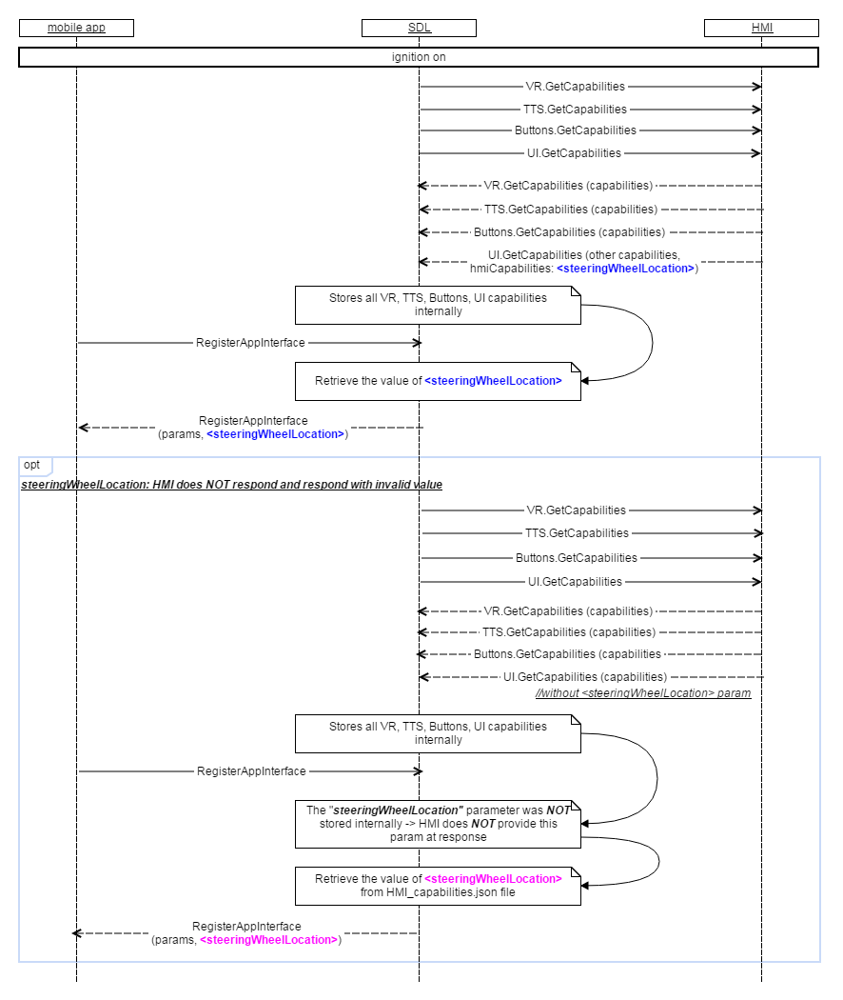

## GetCapabilities

Type
: Function

Sender
: SDL

Purpose
: Inform SDL of the UI capabilities of the vehicle.

Once UI module is confirmed to be ready (via response to [IsReady RPC], SDL starts discovering its capabilities via GetCapabilities and GetSupportedLanguages RPCs.   

The response to UI.GetCapabilities is assumed to bring all the information required for correct configuring the ‘display’ requests to UI.   

[IsReady RPC]: ../../navigation/isready/index.md#isready   
  

### Request   

#### Behavior:   

!!! MUST   
1)	Check the capabilities of:   
•	Display: its type, the fields supported, the format of media clock supported, whether displaying images are supported and of what type if so, image capabilities, available persistent display templates and number of presets etc.   
•	Zone the UI is located in (front/back display).   
•	Soft buttons: whether the notifications on events of softbutton depress/release and on button presses of short/long are supported.   
•	Embedded Navigation supported.   
•	Phone calles supported.   
•	Audio capturing: the sampling rate, bits per sample, audio type supported.   
• Vehicle driver location information is provided.   
2)	Respond correspondingly to results of this check.   

**HMI expected behavior** within _SteeringWheelLocation_ parameter:   
The system shall provide the vehicle driver location as part of the response to a registration request.
The system shall provide a value of:   
0 - for Left Hand Drive;   
1 - for Right Hand Drive.   
The system shall source the vehicle driver location information from DID 0xDE00, Byte 4, Bit 6.   
For Vehicle Driver Location information, a value of:   
0 - means the vehicle is Left Hand Drive;   
1 - means the vehicle is Right Hand Drive.   
!!!

!!! NOTE      
- _The expected UI capabilities are described in the section [Parameters] linked to the corresponding structures and enumerations with more detailed information._   
- _SDL must return the value of "steeringWheelLocation" received from HMI or retrieved from 'HMI_capabilities.json' file._   
!!!

#### Parameters

### Response   

This RPC has no additional parameter requirements.

#### Parameters

|Name|Type|Mandatory|Additional|Description|
|:---|:---|:--------|:---------|:----------|
|displayCapabilities|[Common.DisplayCapabilities]|true|-|The capabilities of HMI\`s display: its type, supported textfields, whether the graphics displaying is supported, the supported formats of media clock.|
|audioPassThruCapabilities|[Common.AudioPassThruCapabilities]|true|-|Specifies the capabilities of audio capturing: sampling rate, bits per sample, audio type.|
|hmiZoneCapabilities|[Common.HmiZoneCapabilities]|true|-|Specifies HMI Zones in the vehicle (front/back).|
|softButtonCapabilities|[Common.SoftButtonCapabilities]|false|Array = true<br>minsize = 1<br>maxsize = 100|Must be returned if the platform supports on-screen soft buttons. Contains the soft buttons capabilities: whether the up/down events, long/short press, referencing image are supported.|
|hmiCapabilities|[Common.HMICapabilities]|false|-|Specifies the HMI capabilities of navigation and phonecall support.|

[Common.DisplayCapabilities]: ../../common/structs/displaycapabilities
[Common.AudioPassThruCapabilities]: ../../common/structs/audiopassthrucapabilities
[Common.HmiZoneCapabilities]: ../../common/enums/hmizonecapabilities
[Common.SoftButtonCapabilities]: ../../common/structs/softbuttoncapabilities
[Common.HMICapabilities]: ../../common/structs/hmicapabilities

### Sequence Diagrams

|||
Get Capabilities

|||

|||
RegisterAppInterface: SDL must provide the value of _steeringWheelLocation_ parameter at response as a part of HMICapabilities struct.

|||

### Example Request

```json
{
  "id" : 18,
  "jsonrpc" : "2.0",
  "method" : "UI.GetCapabilities"
}
```
### Example Response

```json
{
  "id" : 18,
  "jsonrpc" : "2.0",
  "result" :
  {
    "displayCapabilities" :
    {
        "displayType" : "GEN2_8_DMA",
        "textFields" : ["mainField1", "mainField2", "mediaclock", "mediaTrack", "alertText1", "alertText2", "alertText3", "scrollableMessageBody", "initialInteractionText", "navigationText1", "navigationText2", "audioPassThruDisplayText1", "audioPassThruDisplayText2", "notificationText"],
        "mediaClockFormats" : ["CLOCK1", "CLOCKTEXT4"],
        "graphicSupported" : true,
        "imageCapabilities": ["DYNAMIC"]
    },
  "hmiCapabilities" :
    {
        "navigation" : false,
        "phoneCall" : true
        "steeringWheelLocation" : "LEFT"
    },

    "softButtonCapabilities" :
    {
        "shortPressAvailable" : true,
        "longPressAvailable" : true,
        "upDownAvailable" : true,
        "imageSupported" : true
    },

    "hmiZoneCapabilities" : "FRONT",

    "audioPassThruCapabilities" :
    {
        "samplingRate" : "44KHZ",
        "bitsPerSample" : "8_BIT",
        "audioType" : "PCM"
    },

    "code" : 0,
    "method" : "UI.GetCapabilities"
  }
}
```

### Example Error

```json
{
  "id" : 18,
  "jsonrpc" : "2.0",
  "error" :
  {
    "code" : 22,
    "message" : "During API call the unknown error has occurred",
    "data" :
    {
      "method" : "UI.GetCapabilities"
    }
  }
}
```
