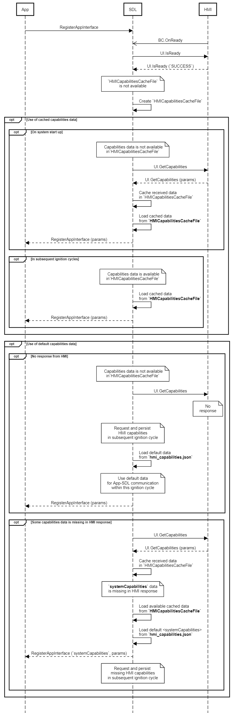

## GetCapabilities

Type
: Function

Sender
: SDL

Purpose
: Inform SDL of the UI capabilities of the vehicle.


### Request

#### Parameters

|Name|Type|Mandatory|Additional|Description|
|:---|:---|:--------|:---------|:----------|

### Response

#### Parameters

|Name|Type|Mandatory|Additional|Description|
|:---|:---|:--------|:---------|:----------|
|displayCapabilities|Common.DisplayCapabilities|true|||
|audioPassThruCapabilities|Common.AudioPassThruCapabilities|true|||
|hmiZoneCapabilities|Common.HmiZoneCapabilities|true|||
|softButtonCapabilities|Common.SoftButtonCapabilities|false|||
|hmiCapabilities|Common.HMICapabilities|false|||

#### DisplayCapabilities

|Name|Type|Mandatory|Additional|Description|
|:---|:---|:--------|:---------|:----------|
|displayType|Common.DisplayType|true|||
|textFields|Common.TextField|true|array: true<br>minsize: 0<br>maxsize: 100||
|imageFields|Common.ImageField|false|array: true<br>minsize: 1<br>maxsize: 100||
|mediaClockFormats|Common.MediaClockFormat|true|array: true<br>minsize: 0<br>maxsize: 100||
|imageCapabilities|Common.ImageType|false|array: true<br>minsize: 0<br>maxsize: 2||
|graphicSupported|Boolean|true|||
|templatesAvailable|String|true|array: true<br>minsize: 0<br>maxsize: 100<br>maxlength: 100||
|screenParams|Common.ScreenParams|false|||
|numCustomPresetsAvailable|Integer|false|minvalue: 1<br>maxvalue: 100||

#### AudioPassThruCapabilities

|Name|Type|Mandatory|Additional|Description|
|:---|:---|:--------|:---------|:----------|
|samplingRate|Common.SamplingRate|true|||
|bitsPerSample|Common.BitsPerSample|true|||
|audioType|Common.AudioType|true|||

#### HmiZoneCapabilities

|Name|Value|
|:---|:----|
|FRONT|0|
|BACK|1|

#### SoftButtonCapabilities

|Name|Type|Mandatory|Additional|Description|
|:---|:---|:--------|:---------|:----------|
|shortPressAvailable|Boolean|true|||
|longPressAvailable|Boolean|true|||
|upDownAvailable|Boolean|true|||
|imageSupported|Boolean|true|||

#### HMICapabilities

|Name|Type|Mandatory|Additional|Description|
|:---|:---|:--------|:---------|:----------|
|navigation|Boolean|false|||
|phoneCall|Boolean|false|||

### Sequence Diagrams
|||
Get Capabilities

|||

### Example Request

```json
{
	"id" : 18,
	"jsonrpc" : "2.0",
	"method" : "UI.GetCapabilities"
}
```
### Example Response

```json
{
	"id" : 18,
	"jsonrpc" : "2.0",
	"result" :
	{
		"displayCapabilities" :
		{
				"displayType" : "GEN2_8_DMA",
				"textFields" : ["mainField1", "mainField2", "mediaclock", "mediaTrack", "alertText1", "alertText2", "alertText3", "scrollableMessageBody", "initialInteractionText", "navigationText1", "navigationText2", "audioPassThruDisplayText1", "audioPassThruDisplayText2", "notificationText"],
				"mediaClockFormats" : ["CLOCK1", "CLOCKTEXT4"],
				"graphicSupported" : true,
				"imageCapabilities": ["DYNAMIC"]
		},
	"hmiCapabilities" :
		{
				"navigation" : true,
				"phoneCall" : true
		},

		"softButtonCapabilities" :
		{
				"shortPressAvailable" : true,
				"longPressAvailable" : true,
				"upDownAvailable" : true,
				"imageSupported" : true
		},

		"hmiZoneCapabilities" : "FRONT",

		"audioPassThruCapabilities" :
		{
				"samplingRate" : "44KHZ",
				"bitsPerSample" : "8_BIT",
				"audioType" : "PCM"
		},

		"code" : 0,
		"method" : "UI.GetCapabilities"
	}
}
```

### Example Error

```json
{
	"id" : 18,
	"jsonrpc" : "2.0",
	"error" :
	{
		"code" : 22,
		"message" : "During API call the unknown error has occurred",
		"data" :
		{
			"method" : "UI.GetCapabilities"
		}
	}
}
```
