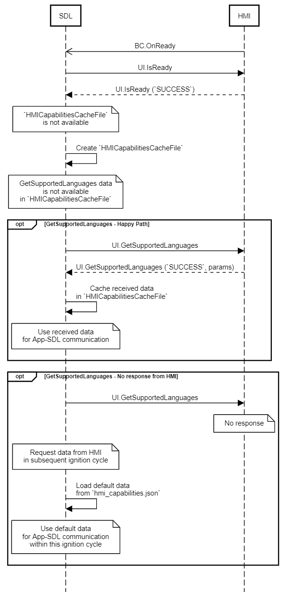

## GetSupportedLanguages

Type
: Function

Sender
: SDL

Purpose
: Get the supported UI languages

### Request

#### Parameters

This RPC has no additional parameter requirements

### Response

#### Parameters

|Name|Type|Mandatory|Additional|
|:---|:---|:--------|:---------|
|languages|[Common.Language](../../common/enums/#language)|true|array: true<br>minsize: 1<br>maxsize: 100|

### Sequence Diagrams
|||
Get Supported Languages

|||

### JSON Message Examples

#### Example Request

```json
{
  "id" : 99,
  "jsonrpc" : "2.0",
  "method" : "UI.GetSupportedLanguages"
}
```

#### Example Response

```json
{
  "id" : 99,
  "jsonrpc" : "2.0",
  "result" :
  {
    "languages" : ["AR-SA", "DE-DE", "EN-GB", "EN-US", "ES-ES", "FR-FR", "IT-IT"],
    "code" : 0,
    "method" : "UI.GetSupportedLanguages"
  }
}
```

#### Example Error

```json
{
  "id" : 99,
  "jsonrpc" : "2.0",
  "error" :
  {
    "code" : 9,
    "message" : "The requested data is not available",
    "data" :
    {
      "method" : "UI.GetSupportedLanguages"
    }
  }
}
```
