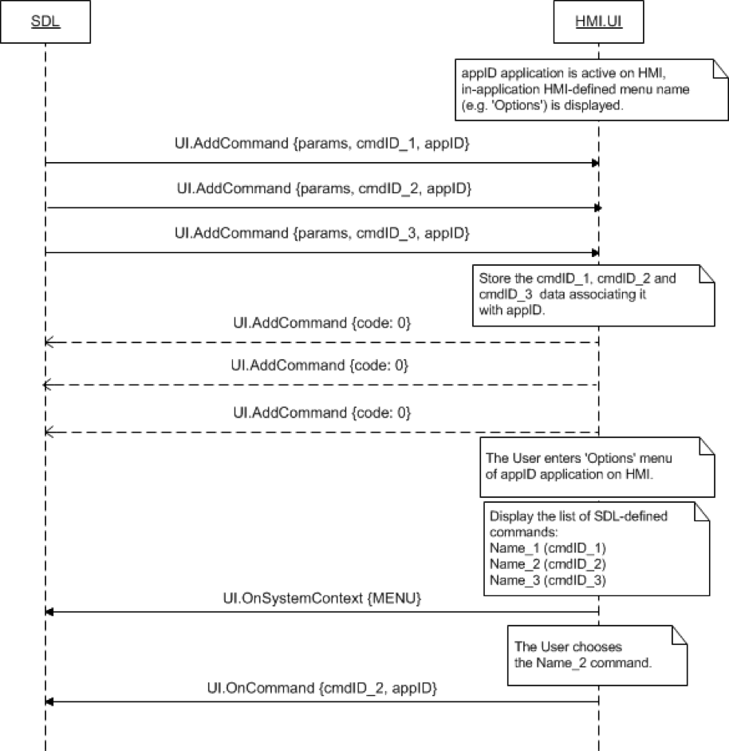

## OnCommand

Type
: Notification

Sender
: HMI

Purpose
: Inform SDL that a command has been chosen by the User from the UI.

### Notification

#### Parameters

|Name|Type|Mandatory|Additional|
|:---|:---|:--------|:---------|
|cmdID|Integer|true|minvalue: 0<br>maxvalue: 2000000000|
|appID|Integer|true||
### Sequence Diagrams
|||
OnCommand

|||

#### JSON Example Notification
```json
{
  "jsonrpc" : "2.0",
  "method" : "UI.OnCommand",
  "params" :
  {
    "cmdID" : 2318,
     "appID" : 65409
  }
}
```
