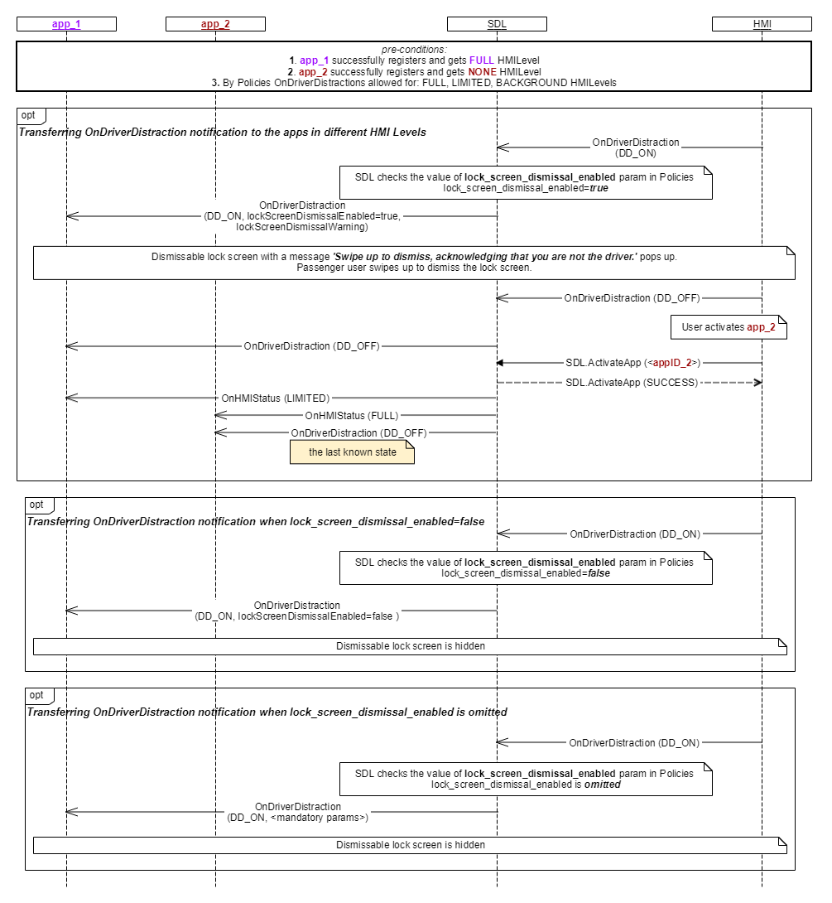

## OnDriverDistraction

Type
: Notification

Sender
: HMI

Purpose
: Inform SDL about changes to the Driver Distraction state.

### Notification

!!! must

1. Inform SDL whenever the driver distraction mode is activated/deactivated on HMI.
2. Allow a passenger to dismiss the lock screen.

!!!

Driver distraction rules may be specific to contry/area, so it depends on HMI when to trigger activate/deactivate states.

_Note: SDL ignores all invalid notifications which come from HMI (invalid JSON, invalid data types/bounds etc)_

#### Parameters

|Name|Type|Mandatory|Additional|
|:---|:---|:--------|:---------|
|state|[Common.DriverDistractionState](../../common/enums/#driverdistractionstate)|true||

### Sequence Diagrams
|||
OnDriverDistraction

|||


#### JSON Example Notification
```json
{
  "jsonrpc" : "2.0",
  "method" : "UI.OnDriverDistraction",
  "params" :
  {
    "state" : "DD_ON"
  }
}
```
