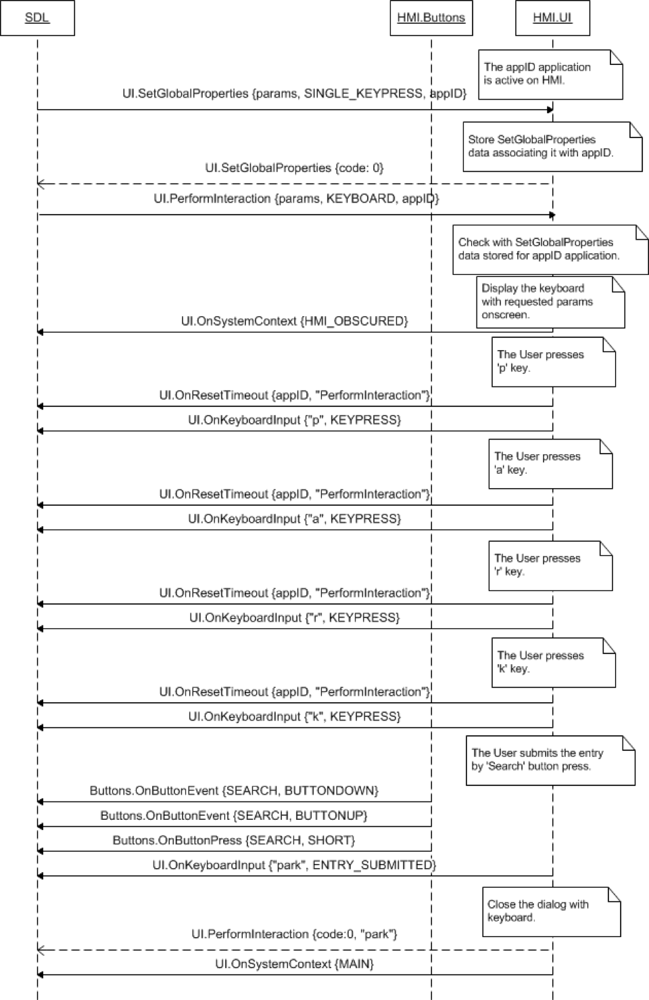
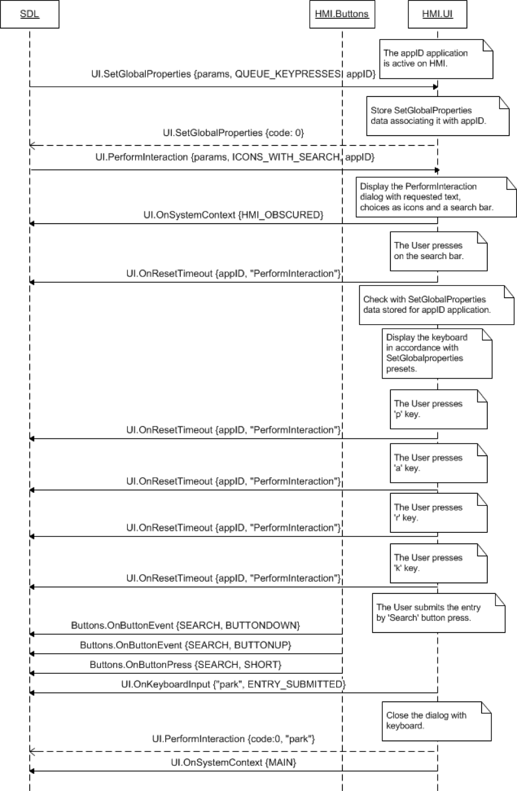
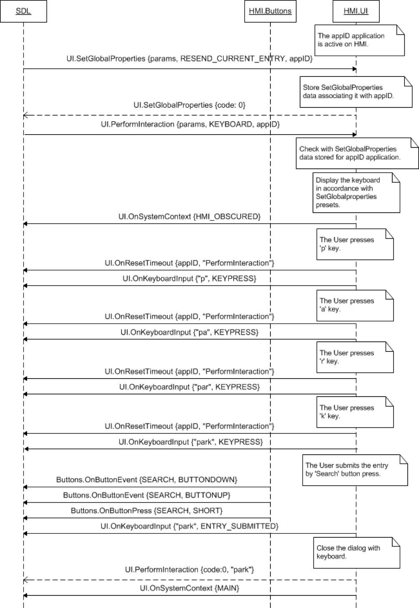
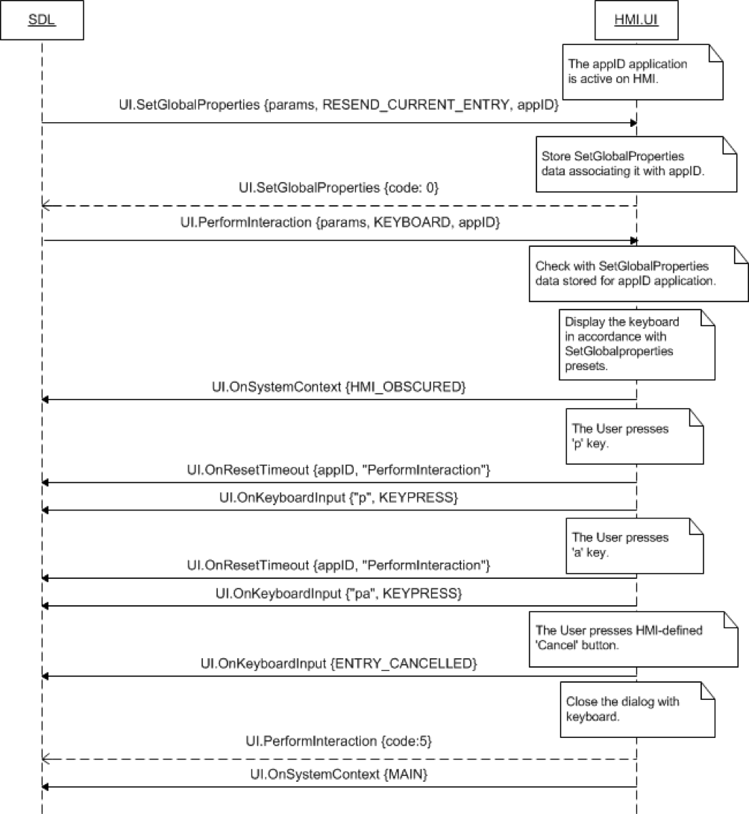
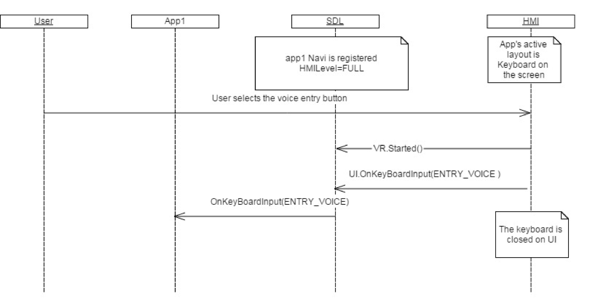

## OnKeyboardInput

Type
: Notification

Sender
: HMI

Purpose
: Inform SDL that a keyboard event has occurred.

### Notification

#### Parameters

|Name|Type|Mandatory|Additional|
|:---|:---|:--------|:---------|
|event|[Common.KeyboardEvent](../../Common/Enums/index.md#keyboardevent)|true||
|data|String|false|minlength: 0<br>maxlength: 500|

### Sequence Diagrams
|||
OnKeyboardInput SINGLE_KEYPRESS mode

|||
|||
OnKeyboardInput QUEUE_KEYPRESSES mode

|||
|||
OnKeyboardInput RESEND_CURRENT_ENTRY mode

|||
|||
OnKeyboardInput cancelled

|||
|||
OnKeyboardInput ENTRY_VOICE mode

|||

#### JSON Example Notification
```json
{
  "jsonrpc" : "2.0",
  "method" : "UI.OnKeyboardInput",
  "params" :
  {
    "event" : "ENTRY_CANCELLED"
  }
}
```
