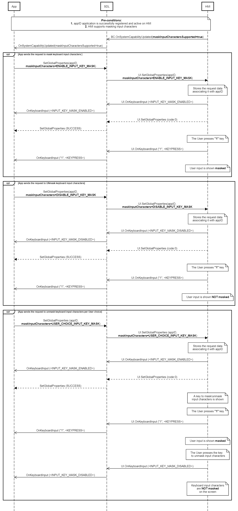

## OnKeyboardInput

Type
: Notification

Sender
: HMI

Purpose
: Inform SDL that a keyboard event has occurred.

### Notification

!!! MUST

Notify SDL whether keyboard input characters are displayed as masked or not masked on HMI screen. 

!!!

!!! NOTE

1. By default keyboard input characters are not masked.
2. When `maskInputCharacters` value is set to "USER_CHOICE_INPUT_KEY_MASK", HMI masks input characters **and** provides a toggle button allowing the user to unmask them if needed.

!!!

#### Parameters

|Name|Type|Mandatory|Additional|
|:---|:---|:--------|:---------|
|event|[Common.KeyboardEvent](../../common/enums/#keyboardevent)|true||
|data|String|false|minlength: 0<br>maxlength: 500|

### Sequence Diagrams

|||
OnKeyboardInput SINGLE_KEYPRESS mode

|||

|||
OnKeyboardInput QUEUE_KEYPRESSES mode

|||

|||
OnKeyboardInput RESEND_CURRENT_ENTRY mode

|||

|||
OnKeyboardInput cancelled

|||

|||
OnKeyboardInput ENTRY_VOICE mode

|||

|||
KeyboardEvent InputKeyMask

|||

### JSON Message Examples

#### Example Notification

```json
{
  "jsonrpc" : "2.0",
  "method" : "UI.OnKeyboardInput",
  "params" :
  {
    "event" : "ENTRY_CANCELLED"
  }
}
```
