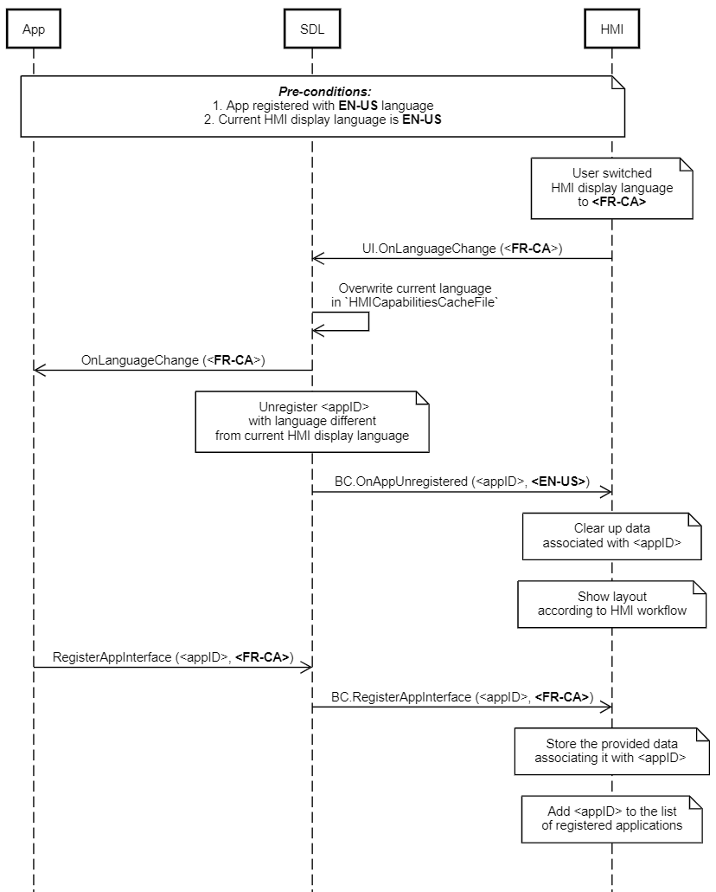

## OnLanguageChange


### Notification

#### Parameters

|Name|Type|Mandatory|Additional|Description|
|:---|:---|:--------|:---------|:----------|
|language|Common.Language|true|||

#### Language

|Name|Value|
|:---|:----|
|EN-US|0|
|ES-MX|1|
|FR-CA|2|
|DE-DE|3|
|ES-ES|4|
|EN-GB|5|
|RU-RU|6|
|TR-TR|7|
|PL-PL|8|
|FR-FR|9|
|IT-IT|10|
|SV-SE|11|
|PT-PT|12|
|NL-NL|13|
|EN-AU|14|
|ZH-CN|15|
|ZH-TW|16|
|JA-JP|17|
|AR-SA|18|
|KO-KR|19|
|PT-BR|20|
|CS-CZ|21|
|DA-DK|22|
|NO-NO|23|

### Sequence Diagrams
|||
OnLanguageChange

|||

#### JSON Example Notification
```json
{
	"jsonrpc" : "2.0",
	"method" : "UI.OnLanguageChange",
	"params" :
	{
		"language" : "FR-CA"
	}
}
```
