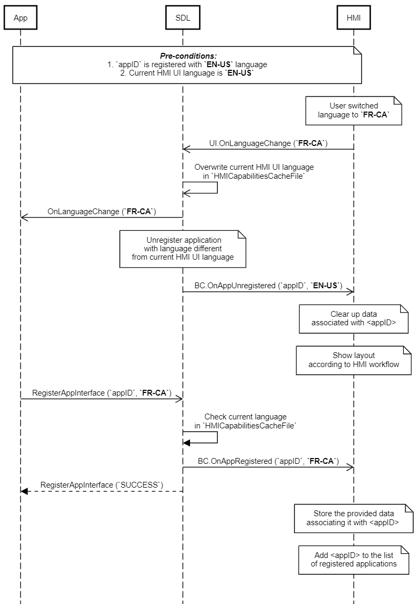

## OnLanguageChange

Type
: Notification

Sender
: HMI

Purpose
: Inform SDL that the UI display language has changed.

### Notification

#### Parameters

|Name|Type|Mandatory|Additional|
|:---|:---|:--------|:---------|
|language|[Common.Language](../../common/enums/#language)|true||

### Sequence Diagrams
|||
OnLanguageChange

|||

### JSON Message Examples

#### Example Notification
```json
{
  "jsonrpc" : "2.0",
  "method" : "UI.OnLanguageChange",
  "params" :
  {
    "language" : "FR-CA"
  }
}
```
