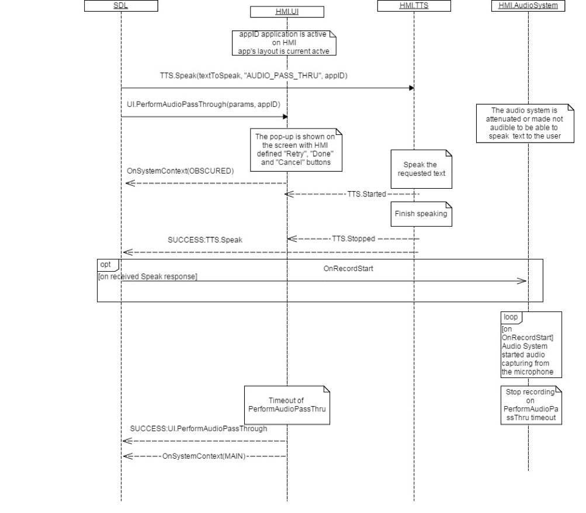

## OnRecordStart

Type
: Function

Sender
: SDL

Purpose
: Notify HMI that capturing microphone data should begin

### Notification

#### Parameters

|Name|Type|Mandatory|Additional|
|:---|:---|:--------|:---------|
|appID|Integer|true||

### Sequence Diagrams

|||
OnRecordStart with TTS.Speak

|||
|||
OnRecordStart without TTS.Speak

|||
|||
OnRecordStart not sent if UI.PerformAudioPassThru rejected

|||

### JSON Message Examples

#### Example Notification

```json
{
  "jsonrpc" : "2.0",
  "method" : "UI.OnRecordStart",
  "params" :
  {
    "appID" : 65537
  }
}
```
