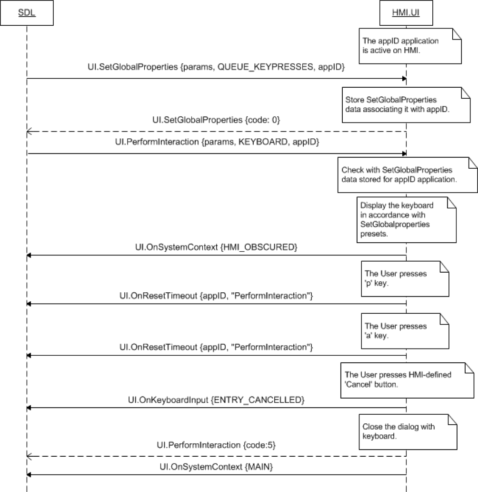
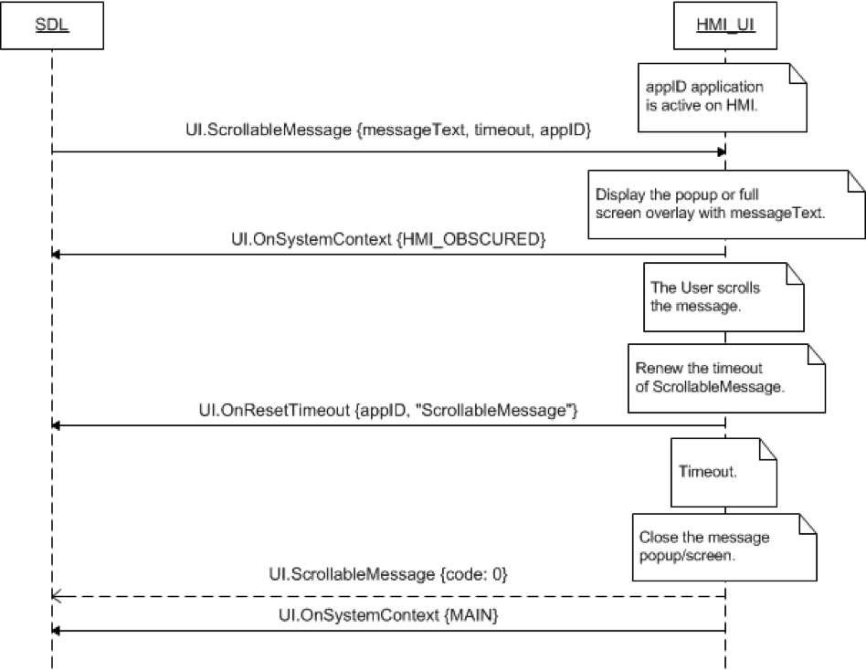
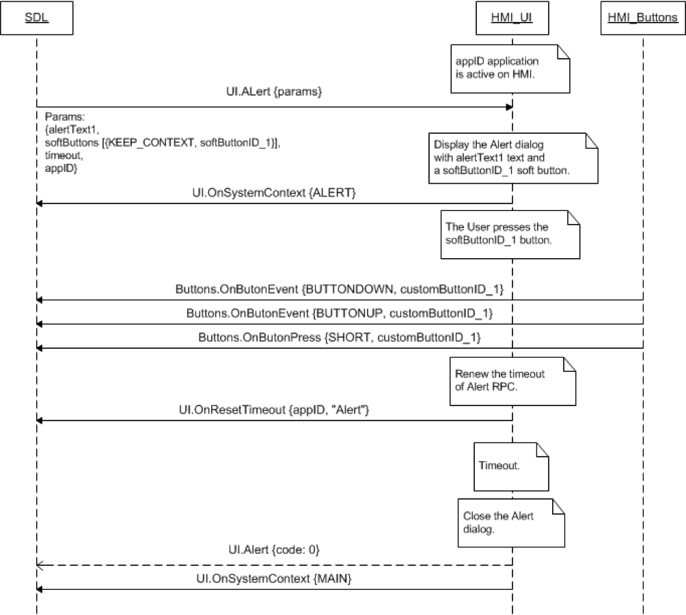

## OnResetTimeout

### Notification

#### Parameters

|Name|Type|Mandatory|Additional|Description|
|:---|:---|:--------|:---------|:----------|
|appID|Integer|true|||
|methodName|String|true|||

### Sequence Diagrams
|||
OnResetTimeout during PerformInteraction

|||
|||
OnResetTimeout during ScrollableMessage

|||
|||
OnResetTimeout KEEP_CONTEXT during alert

|||
