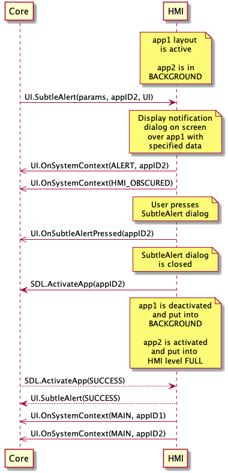

## OnSubtleAlertPressed

Type
: Notification

Sender
: HMI

Purpose
: Inform SDL that a SubtleAlert dialog was pressed

### Notification

!!! must

1. Activate the application associated with this SubtleAlert dialog

!!!

#### Parameters

|Name|Type|Mandatory|Additional|
|:---|:---|:--------|:---------|
|appID|Integer|true||

### Sequence Diagrams

|||
OnSubtleAlertPressed during SubtleAlert in BACKGROUND

|||

### JSON Message Examples

#### Example Notification

```json
{
  "jsonrpc" : "2.0",
  "method" : "UI.OnSubtleAlertPressed",
  "params" : {
    "appID" : 65368
  }
}
```
