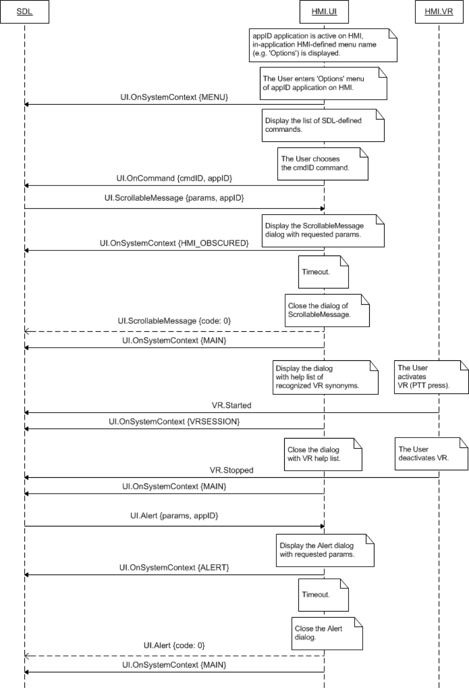

## OnSystemContext

Type
: Notification

Sender
: HMI

Purpose
: Inform SDL about the current context of app interaction.

### Notification

#### Parameters

|Name|Type|Mandatory|Additional|
|:---|:---|:--------|:---------|
|systemContext|[Common.SystemContext](../../common/enums/#systemcontext)|true||
|appID|Integer|false||
|windowID|Integer|false||

### Sequence Diagrams
|||
OnSystemContext for different HMI States

|||

### Example Notification
```json
{
  "jsonrpc" : "2.0",
  "method" : "UI.OnSystemContext",
  "params" :
  {
    "systemContext" : "VRSESSION"
  }
}
```
