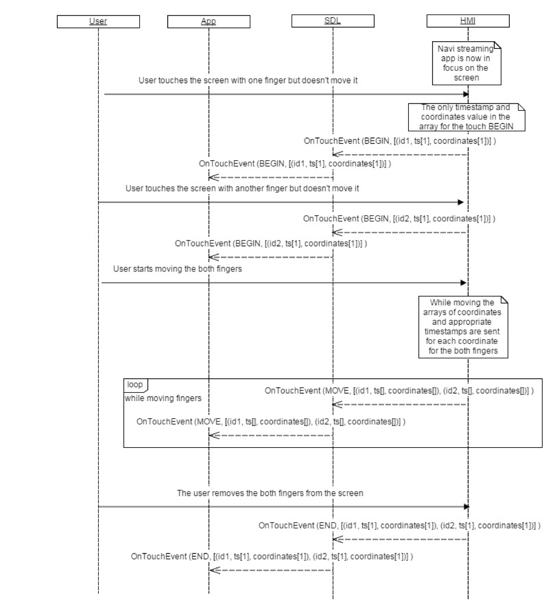
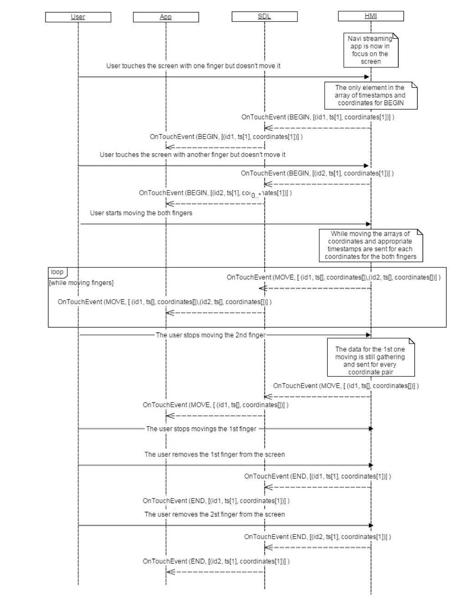

## OnTouchEvent

### Notification

#### Parameters

|Name|Type|Mandatory|Additional|Description|
|:---|:---|:--------|:---------|:----------|
|type|Common.TouchType|true|||
|event|Common.TouchEvent|true|array: true minsize: 1 maxsize: 10||

#### TouchType

|Name|Value|
|:---|:----|
|BEGIN|0|
|MOVE|1|
|END|2|

#### TouchEvent

|Name|Type|Mandatory|Additional|Description|
|:---|:---|:--------|:---------|:----------|
|id|Integer|true|minvalue: 0 maxvalue: 9||
|ts|Integer|true|array: true minsize: 1 maxsize: 1000 minvalue: 0 maxvalue: 2147483647||
|c|Common.TouchCoord|true|array: true minsize: 1 maxsize: 1000||

### Sequence Diagrams
|||
OnTouchEvent moving two fingers stop together

|||
|||
OnTouchEvent moving two fingers one stops first

|||
