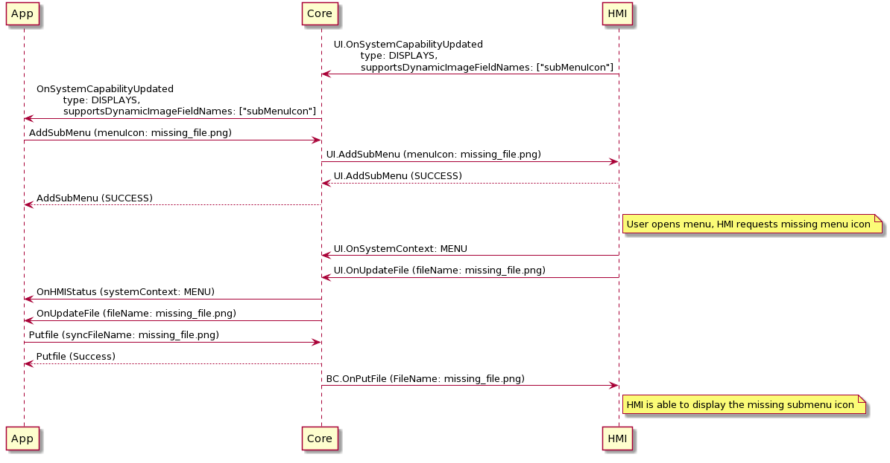

## OnUpdateFile

Type
: Notification

Sender
: HMI

Purpose
: For the HMI to tell Core that a file needs to be retrieved from the app.

### Notification

### Parameters
|Name|Type|Mandatory|Additional|
|:---|:---|:--------|:---------|
|appID|Integer|true||
|fileName|String|true|maxlength: 255|

### Sequence Diagrams

|||
Requesting missing menuIcon for submenu 

|||


### JSON Message Examples

#### Example Notification

```json
{
  "jsonrpc" : "2.0",
  "method" : "UI.OnUpdateFile",
  "params" :
  {
    "appID": 12345678,
    "fileName": "image_file_name.png"
  }
}