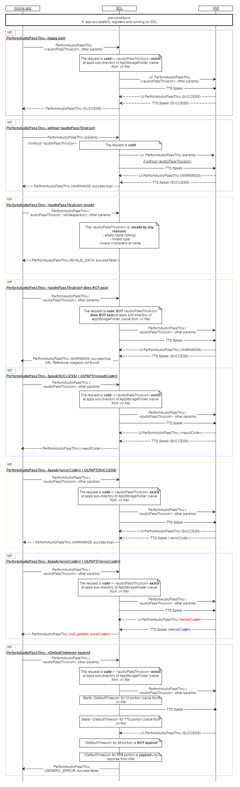

## PerformAudioPassThru

Type
: Function

Sender
: SDL

Purpose
: Start audio capturing and sending PCM data to SDL

SDL prompts HMI to inform the User about a start of audio capturing and by displaying the dialog with the requested text information.   

The request may arrive in both cases of active and background application on HMI.   

!!! NOTE   
This RPC may arrive together with TTS.Speak which purpose is to inform the User about start of audio capturing by the means of TTS module. In case of no TTS, SDL starts capturing audio right after sending UI.PerformAPT_request to HMI with using GSTreamer library.
!!!

### Request
#### Behavior   

!!! MUST   
1)	Display the dialog with requested text (_audioPassThruDisplayText1_ and _audioPassThruDisplayText2_ text fields).   
2)	Attenuate or mute any audio source except of TTS speaking (depending on HMI capabilities).   
!!! NOTE   
If PerfromAudioPassThru request is accompanied with TTS.Speak RPC, SDL starts the audio capturing with GSTreamer library only after TTS finishes speaking the requested text (after receiving TTS.SPEAK: SUCCESS response).
!!!
3)	Keep displaying the dialog and capturing the audio until:   
- The value of maxDuration is reached.   
- The User presses any of HMI-defined ‘Cancel’/’Done’/’Retry’ buttons.   
- The request of EndAudioPassThru comes from SDL.   
4)	Respond the request.   
!!!

_**HMI must not**_ return the OnButtonEvent/OnButtonPress notifications to SDL when such soft button is pressed by the User.

!!! IMPORTANT
SDL performs audio data capturing and transferring to mobile side by itself (no HMI API are involved). There are two options: 
a)	SDL is built with  “-DEXTENDED_MEDIA_MODE=OFF” flag (for the testing purposes). In this case SDL reads the hardcoded .wav file (filename is _RecordingFileSource_ located in _AppStorageFolder_) and sends data read via OnAudioPassThru to mobile application.   
b)	SDL is built with “-DEXTENDED_MEDIA_MODE=ON”. In this case SDL reads the data from the connected microphone and sends data read via OnAudioPassThru to mobile application.  
!!!

_**Notes for HMI expected behavior:**_   
- The system shall accept requests for AudioPassThru with a reference image.   
- When the system receives a request for AudioPassThru with a reference to a valid image, the system shall display the image on the pop-up of the PerformAudioPassThru.   
- The system shall accept images of type STATIC and DYNAMIC for AudioPassThru.   
- If the image referenced in a request for AudioPassThru is not valid or not available or no image is referenced, the system shall continue processing the request by showing the default image.The system shall provide warning information to the application that the image was not displayed.
(Refer H67D for default image).   

#### Parameters

|Name|Type|Mandatory|Additional|Description|
|:---|:---|:-------|:----------|:----------|
|appID|Integer|true|-|ID of application related to this RPC.|
|audioPassThruDisplayTexts|[Common.TextFieldStruct]|true|array: true<br>minsize: 0<br>maxsize: 2|Uses audioPassThruDisplayText1: First line of text displayed during audio capture; audioPassThruDisplayText2: Second line of text displayed during audio capture.|
|maxDuration|Integer|true|minvalue: 1<br>maxvalue: 1000000|The maximum duration of audio recording in milliseconds. If not provided, the recording should be performed until EndAudioPassThru arrives.|
|muteAudio|Boolean|true|-|Defines if the current audio source should be muted during the APT session. If not, the audio source will play without interruption. If omitted, the value is set to true.|
|audioPassThruIcon|[Common.Image]|false|-|Image struct determining whether static or dynamic icon. If omitted on supported displays, no (or the default if applicable) icon shall be displayed.|

[Common.TextFieldStruct]: ../../common/structs/#textfieldstruct
[Common.Image]: ../../common/structs/#image

### Response

!!! NOTE
There is a difference in message type for WebSocket and D-Bus connection (see the table below).   
!!!

|Result|Description|WebSocket (message type)|D-Bus (message type)|Message Params|
|:------|:---------|:----------------------:|:------------------|:------------:|
|Success|SUCCESS: HMI displayed the PerformAudioPassThru dialog with requested parameters, has just closed it and stopped the audio capturing by: 1) The value of maxDuration reached; 2) The HMI-defined ‘Ok’/’Done’ button press; 3) EndAudioPassThru request from SDL.|JSON response|Method return|code 0|
|Failure|ABORTED: HMI displayed the PerformAudioPassTru dialog with requested parameters, has just closed it and stopped the audio capturing by HMI-defined ‘Cancel’ button press.|JSON error message|Method return|code 5|
|Failure|RETRY: HMI displayed the PerformAudioPassTru dialog with requested parameters, has just closed it and stopped the audio capturing by HMI-defined ‘Retry’ button press.|JSON error message|Method return|code 7|
|Failure|INVALID_DATA: The data sent is invalid (invalid JSON syntax or parameters out of bounds or of wrong type)|JSON error message|Method return|code 11|
|Failure|INVALID_ID: appID is invalid (e.g. doesn’t exist)|JSON error message|Method return|code 13|
|Failure|GENERIC_ERROR: The unknown issue occurred or other codes are not applicable.|JSON error message|Method return|code 22|

Please see [Result Enumeration](../../common/enums/#result) for all SDL-supported codes.

#### Parameters
This RPC has no additional parameter requirements

### Sequence Diagrams

|||
PerformAudioPassThru requested with TTS.Speak

|||

|||
PerformAudioPassThru with EndAudioPassThru

|||

|||
PerformAudioPassThru not supported

|||

|||
PerformAudioPassThru from vehicle microphone

|||

|||
PerformAudioPassThru with audioPassThruIcon param

|||

### Example Request

```json
{
  "id" : 79,
  "jsonrpc" : "2.0",
  "method" : "UI.PerformAudioPassThru",
  "params" :
  {
    "audioPassThruDisplayTexts" :
    {
         "fieldName" :  audioPassThruDisplayText1,
     "fieldText" : "The audio capturing is in progress"
    },
    "maxDuration" : 10000,
  }
}
```
### Example Response

```json
{
  "id" : 79,
  "jsonrpc" : "2.0",
  "result" :
  {
    "code" : 0,
    "method" : "UI.PerformAudioPassThru"
  }
}
```

### Example Error

```json
{
  "id" : 79,
  "jsonrpc" : "2.0",
  "error" :
  {
    "code" : 7,
    "message" : "The user interrupted the RPC and indicated to start over",
    "data" :
    {
      "method" : "UI.PerformAudioPassThru"
    }
  }
}
```
