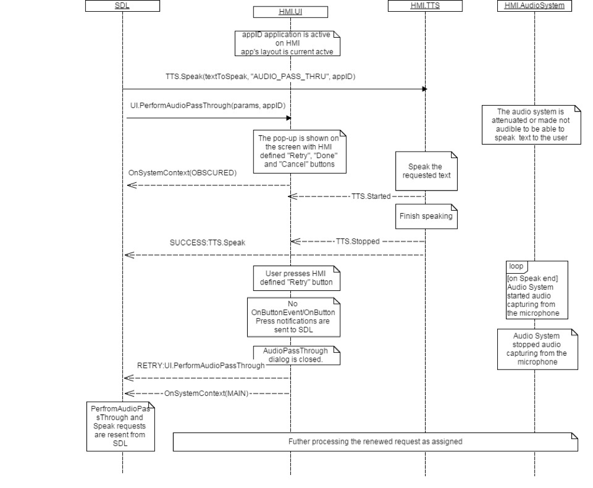
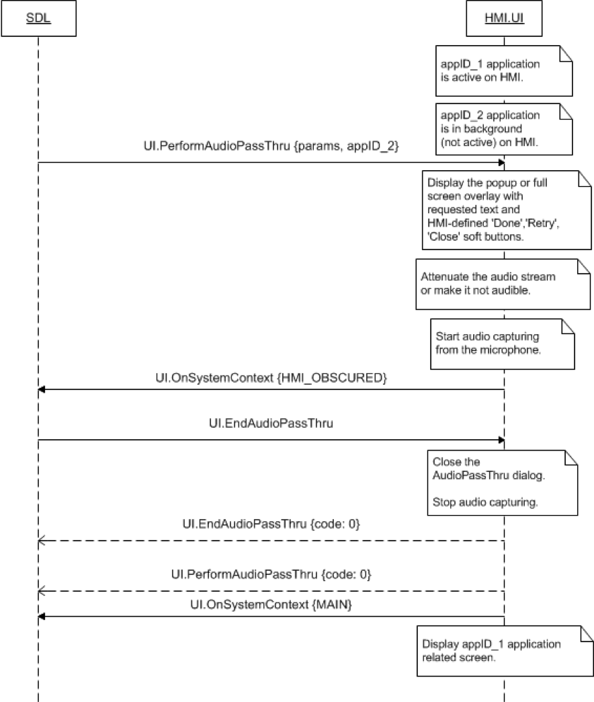
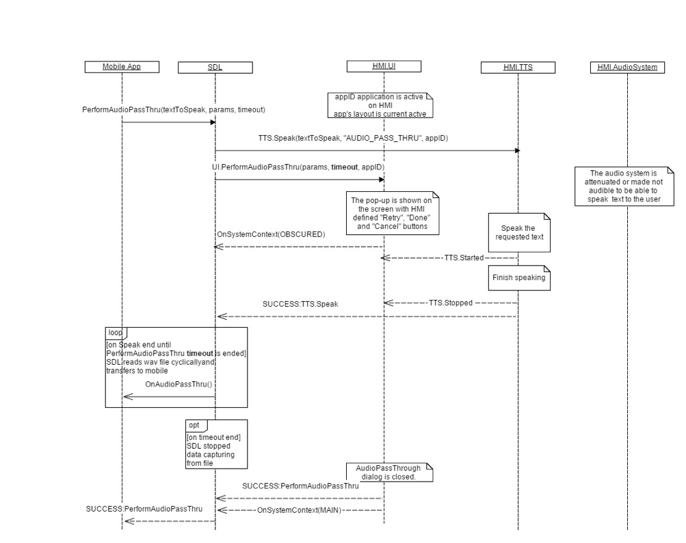
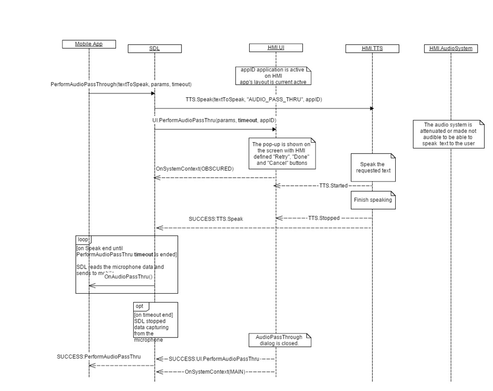

## PerformAudioPassThru

Type
: Function

Sender
: SDL

Purpose
: Start audio capturing and sending PCM data to SDL

### Request

#### Parameters

|Name|Type|Mandatory|Additional|Description|
|:---|:---|:-------|:----------|:----------|
|appID|Integer|true|-|ID of application related to this RPC.|
|audioPassThruDisplayTexts|[Common.TextFieldStruct] (https://github.com/smartdevicelink/sdl_hmi_integration_guidelines/blob/master/docs/Common/Structs/index.md#textfieldstruct)|true|array: true<br>minsize: 0<br>maxsize: 2|Uses audioPassThruDisplayText1: First line of text displayed during audio capture; audioPassThruDisplayText2: Second line of text displayed during audio capture.|
|maxDuration|Integer|true|minvalue: 1<br>maxvalue: 1000000|The maximum duration of audio recording in milliseconds. If not provided, the recording should be performed until EndAudioPassThru arrives.|
|muteAudio|Boolean|true|-|Defines if the current audio source should be muted during the APT session. If not, the audio source will play without interruption. If omitted, the value is set to true.|
|audioPassThruIcon|[Common.Image](https://github.com/smartdevicelink/sdl_hmi_integration_guidelines/blob/master/docs/Common/Structs/index.md#image)|false|-|Image struct determining whether static or dynamic icon. If omitted on supported displays, no (or the default if applicable) icon shall be displayed.|

### Response

#### Parameters

This RPC has no additional parameter requirements

### Sequence Diagrams
|||
PerformAudioPassThru requested with TTS.Speak

|||
|||
PerformAudioPassThru with EndAudioPassThru

|||
|||
PerformAudioPassThru not supported

|||
|||
PerformAudioPassThru from vehicle microphone

|||

### Example Request

```json
{
  "id" : 79,
  "jsonrpc" : "2.0",
  "method" : "UI.PerformAudioPassThru",
  "params" :
  {
    "audioPassThruDisplayTexts" :
    {
         "fieldName" :  audioPassThruDisplayText1,
     "fieldText" : "The audio capturing is in progress"
    },
    "maxDuration" : 10000,
  }
}
```
### Example Response

```json
{
  "id" : 79,
  "jsonrpc" : "2.0",
  "result" :
  {
    "code" : 0,
    "method" : "UI.PerformAudioPassThru"
  }
}
```

### Example Error

```json
{
  "id" : 79,
  "jsonrpc" : "2.0",
  "error" :
  {
    "code" : 7,
    "message" : "The user interrupted the RPC and indicated to start over",
    "data" :
    {
      "method" : "UI.PerformAudioPassThru"
    }
  }
}
```
