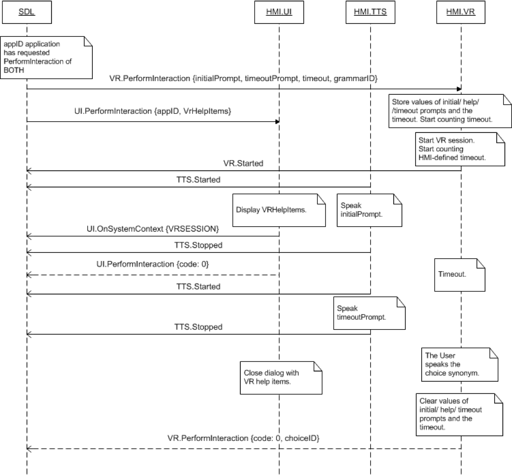

## PerformInteraction

Type
: Function

Sender
: SDL

Purpose
: Perform a UI Interaction with the User.

A request sent by SDL to display a list of choices to the user.

!!! must

  1. Display the choices in `choiceSet` to the user reasonably according to the `interactionLayout`
  2. Wait until the user responds or the request times out to respond to SDL
  2. Include the `choiceID` of the chosen option in the response to SDL
  3. If the interaction times out, respond with a success and no `choiceID` parameter to SDL

!!!

!!! note

A UI.PerformInteraction with a timeout value of `0` should not be timed out immediately. Instead, it should use some default timeout value predetermined by the HMI.

!!!

### Request

#### Parameters

|Name|Type|Mandatory|Additional|
|:---|:---|:--------|:---------|
|initialText|[Common.TextFieldStruct](../../common/structs/#textfieldstruct)|false||
|choiceSet|[Common.Choice](../../common/structs/#choice)|false|array: true<br>minsize: 1<br>maxsize: 100|
|vrHelpTitle|String|false|maxlength: 500|
|vrHelp|[Common.VrHelpItem](../../common/structs/#vrhelpitem)|false|array: true<br>minsize: 1<br>maxsize: 100|
|timeout|Integer|true|minvalue: 5000<br>maxvalue: 100000<br>defvalue: 10000|
|interactionLayout|[Common.LayoutMode](../../common/enums/#layoutmode)|false||
|appID|Integer|true||

### Response

#### Parameters

|Name|Type|Mandatory|Additional|
|:---|:---|:--------|:---------|
|choiceID|Integer|false|minvalue: 0<br>maxvalue: 2000000000|
|manualTextEntry|String|false|minlength: 0<br>maxlength: 500|

### Sequence Diagrams
|||
PerformInteraction Successful with VR Only

|||
|||
PerformInteraction Successful with Manual Only

|||
|||
PerformInteraction Timeout with Both

|||

### Example Request

```json
{
  "id" : 79,
  "jsonrpc" : "2.0",
  "method" : "UI.PerformInteraction",
  "params" :
  {
    "initialText" :
    {
         "fieldName" : "initialInteractionText",
         "fieldText" : "Choose the station:"
    },

    "choiceSet" :
    [
      {
         "choiceID" : 2415,
         "menuName" : "Sky.FM"
      },

      {
         "choiceID" : 2416,
         "menuName" : "Paradise"
      },

      {
         "choiceID" : 2417,
         "menuName" : "100 XR"
      }
    ],

    "vrHelp" :
    [
        {
         "text" : "Sky FM",
         "image" :
          {
             "value" : "tmp/SDL/app/Pandora/icon_5410.jpg",
             "imageType" : "DYNAMIC"
          },

         "position" : 1
        },

        {
         "text" : "Paradise",
         "image" :
          {
             "value" : "tmp/SDL/app/Pandora/icon_5423.jpeg",
             "imageType" : "DYNAMIC"
          },
         "position" : 2
        },

        {
         "text" : "100 XR",
         "image" :
          {
             "value" : "tmp/SDL/app/Pandora/icon_5465.jpeg",
             "imageType" : "DYNAMIC"
          },
         "position" : 3
        }
    ],

    "timeout" : 15000,
    "appID" : 6493
  }
}
```
### Example Response

```json
{
  "id" : 79,
  "jsonrpc" : "2.0",
  "result" :
  {
    "choiceID" : 2416,
    "code" : 0,
    "method" : "UI.PerformInteraction"
  }
}
```

### Example Error

```json
{
  "id" : 79,
  "jsonrpc" : "2.0",
  "error" :
  {
    "code" : 10,
    "message" : "Overlay reached the maximum timeout and closed",
    "data" :
    {
      "method" : "UI.PerformInteraction"
    }
  }
}
```
