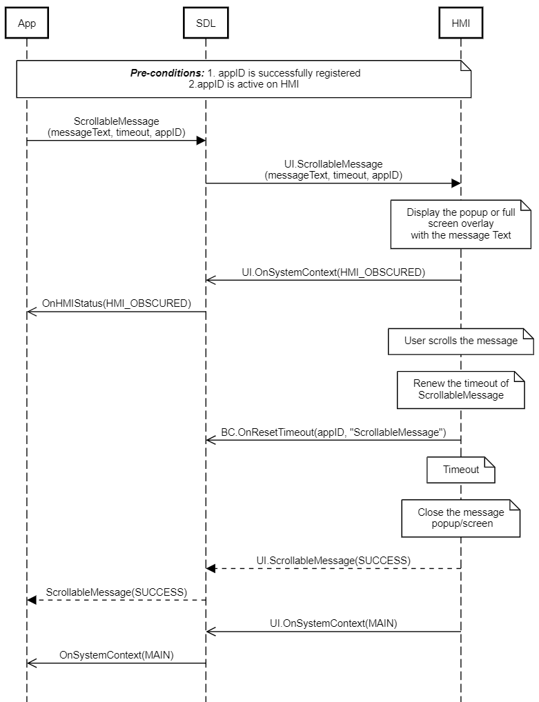
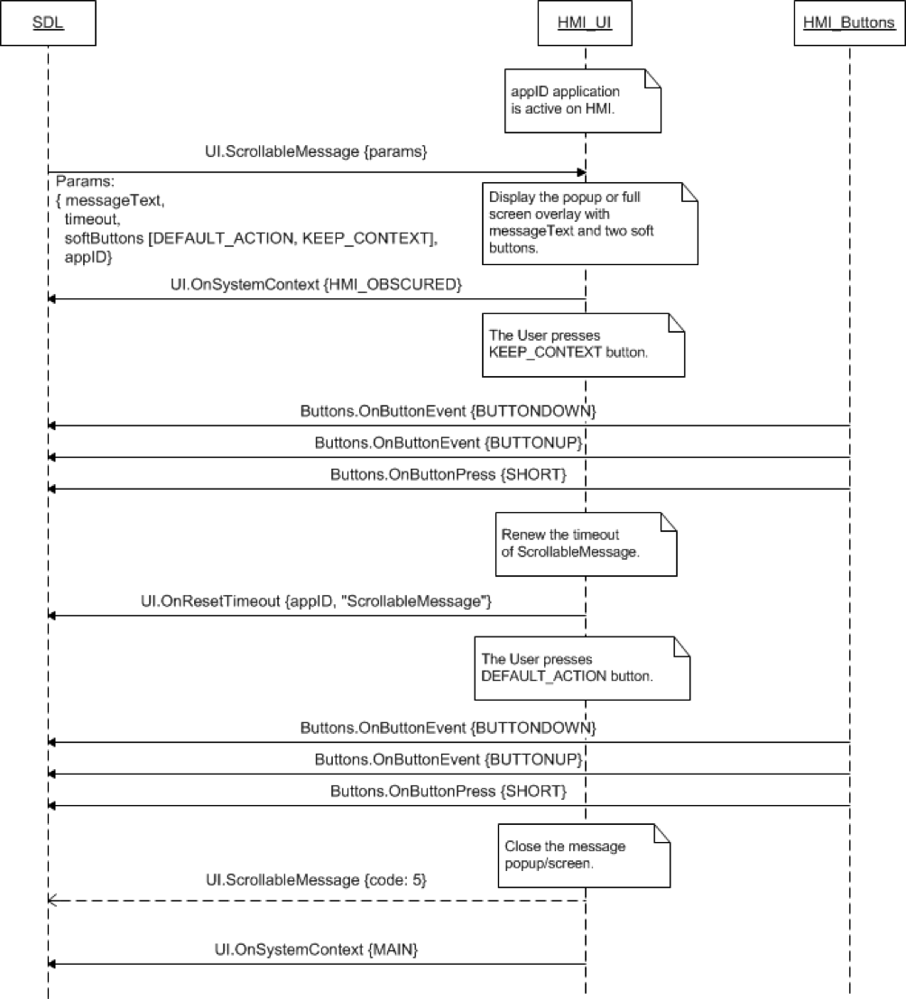
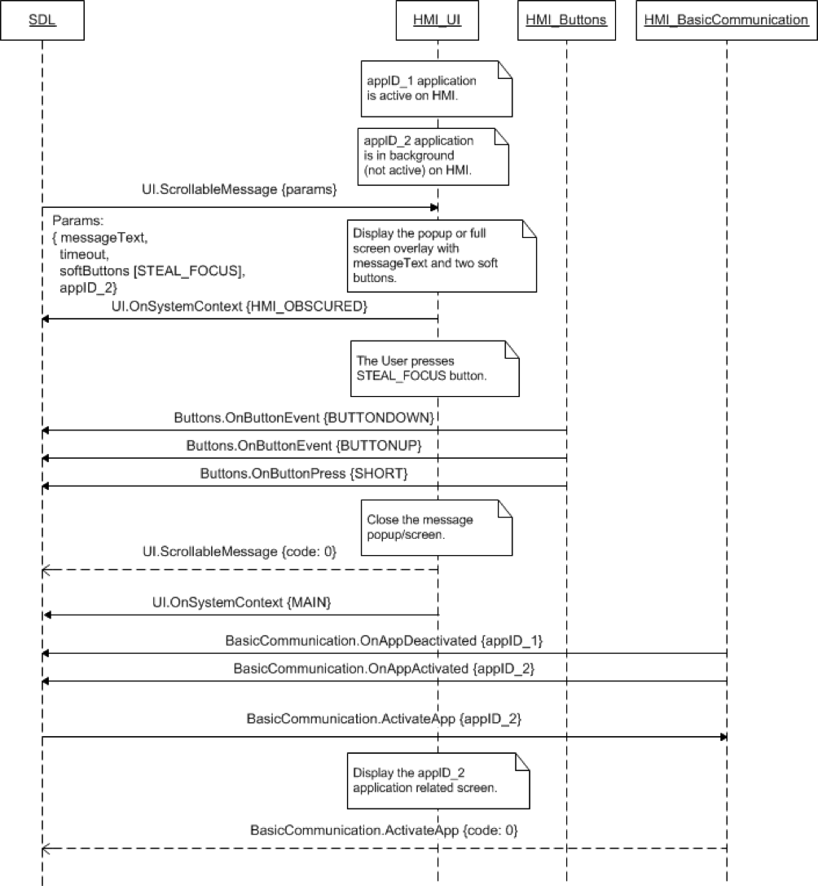

## ScrollableMessage

Type
: Function

Sender
: SDL

Purpose
: Display a dialog that may contain new lines and text which is scrollable by the user.

### Request

#### Parameters

|Name|Type|Mandatory|Additional|
|:---|:---|:--------|:---------|
|messageText|[Common.TextFieldStruct](../../common/structs/#textfieldstruct)|true||
|timeout|Integer|true|minvalue: 0<br>maxvalue: 65535|
|softButtons|[Common.SoftButton](../../common/structs/#softbutton)|false|array: true<br>minsize: 0<br>maxsize: 8|
|appID|Integer|true||

### Response

#### Parameters

This RPC has no additional parameter requirements

### Sequence Diagrams
|||
ScrollableMessage scrolled and closed by timeout

|||
|||
ScrollableMessage with soft buttons pressed by user

|||
|||
ScrollableMessage with STEAL_FOCUS button for background application

|||

### Example Request

```json
{
	"id": 138,
	"jsonrpc": "2.0",
	"method": "UI.ScrollableMessage",
	"params": {
		"messageText": {
			"fieldName": "scrollableMessageBody",
			"fieldText": "Create a Station.\nEnter an artist, song or composer in the Search box in the top left corner. We'll create a radio station featuring that music and more like it. You can also create a new station from the song or artist currently playing by hovering over the album artwork, clicking the white up-arrow and selecting New Station—you can choose From Song or From Artist."
		},
		"timeout": 10000,
		"softButtons": [
      {
				"type": "TEXT",
				"text": "Leave onscreen",
				"softButtonID": 15,
				"systemAction": "KEEP_CONTEXT"
			},
			{
				"type": "TEXT",
				"text": "Cancel",
				"softButtonID": 16,
				"systemAction": "STEAL_FOCUS"
			}
		],
		"appID": 6527
	}
}
```
### Example Response

```json
{
  "id" : 138,
  "jsonrpc" : "2.0",
  "result" :
  {
    "code" : 0,
    "method" : "UI.ScrollableMessage"
  }
}
```

### Example Error

```json
{
  "id" : 138,
  "jsonrpc" : "2.0",
  "error" :
  {
    "code" : 12,
    "message" : "The string data is too long",
    "data" :
    {
      "method" : "UI.ScrollableMessage"
    }
  }
}
```
