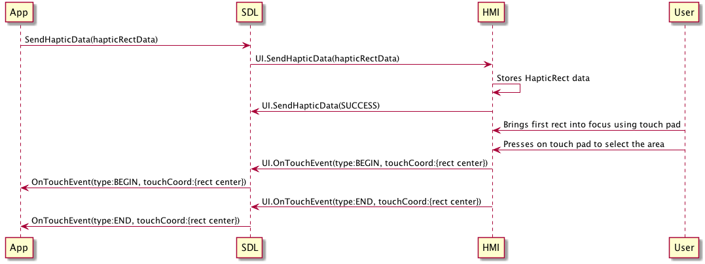

## SendHapticData

Type
: Function

Sender
: SDL

Purpose
: Communicate areas of focus in a video streaming application to the HMI

UI.SendHapticData represents a request for the HMI to keep track of several application-defined areas within a video stream for focus purposes. The HMI should highlight these areas with a rectangle when they are brought into focus on the HMI.

!!! must

The HMI must store the provided HapticRect data and utilize it whenever the users switches focus to part of the application that sent the message.

!!!

!!! must

The HMI must replace all stored HapticRect data every time a new SendHapticData is received for a given application. When an empty hapticRectData array is received, the HMI must clear any existing HapticRect data for that application.

!!!

!!! must

The HMI must send a pair [UI.OnTouchEvent](../ontouchevent) (one BEGIN and one END) with a TouchCoord corresponding to the center of the HapticRect when one of these elements is selected by the user.

!!!

### Request

#### Parameters

|Name|Type|Mandatory|Additional|
|:---|:---|:--------|:---------|
|hapticRectData|[Common.HapticRect](../../common/structs/#hapticrect)|false|array: true<br>minsize: 0<br>maxsize: 1000|
|appID|Integer|true||

### Response

#### Parameters

This RPC has no additional parameter requirements

### Sequence Diagrams

|||
SendHapticData basic flow with user selection 

|||

### Example Request

```json
{
  "id" : 70,
  "jsonrpc" : "2.0",
  "method" : "UI.SendHapticData",
  "params" :
  {
    "hapticRectData" : 
    [
      {
        "id" : 234,
        "rect" : 
        {
          "x" : 567.2,
          "y" : 342.4,
          "width" : 200.0,
          "height": 150.0
        }
      }
    ],
    "appID" : 65464
  }
}
```
### Example Response

```json
{
  "id" : 70,
  "jsonrpc" : "2.0",
  "result" :
  {
    "code" : 0,
    "method" : "UI.SendHapticData"
  }
}
```

### Example Error

```json
{
  "id" : 70,
  "jsonrpc" : "2.0",
  "error" :
  {
    "code" : 2,
    "message" : "The HMI does not support the use of haptic data",
    "data" :
    {
      "method": "UI.SendHapticData"
    }
  }
}
```
