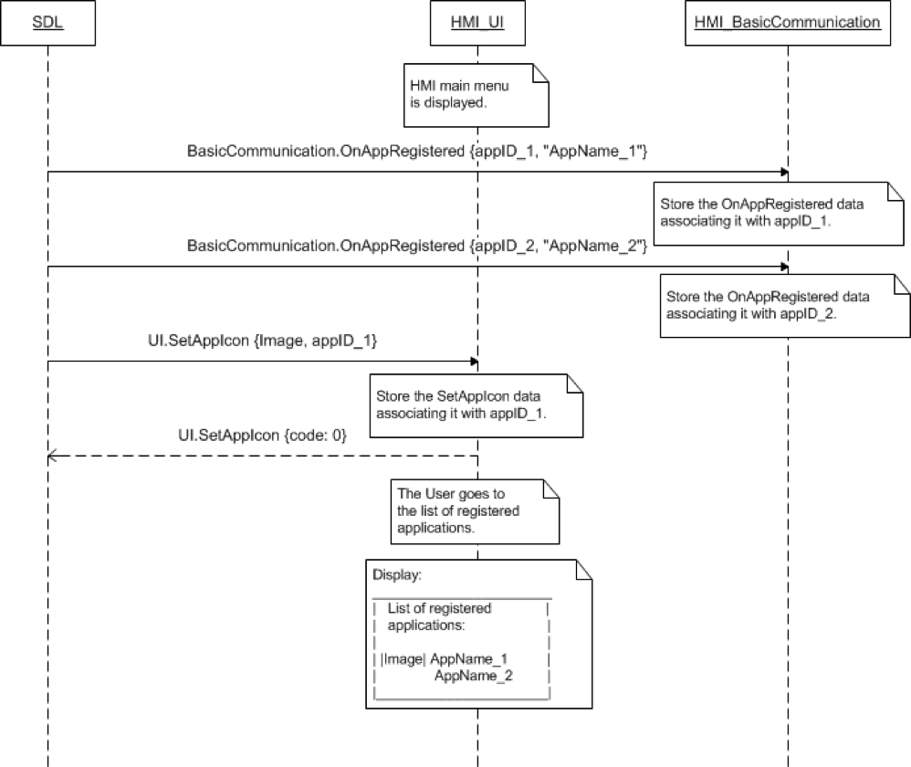

## SetAppIcon

Type
: Function

Sender
: SDL

Purpose
: Display the application's specified icon in the HMI's application list.

### Request

!!! MUST  
1. Keep track and store the the name and file referencing the app icon each time a successful `SetAppIcon` request occurs from the mobile app.  
2. Display the requested icon together with the application name in the HMI list of registered applications:  
    * Right away if the the list of registered applications is currently displayed  
    * When the list of registered applications is displayed upon User's request on HMI  
3. Display default app icon if the mobile application had not previously set an icon successfully and/or the file does not exist on HMI.    
4. Send `BC.OnResetTimeout` notification to SDL for reseting timeout in case HMI needs more time for processing the request.    

!!!

#### Parameters

|Name|Type|Mandatory|Additional|
|:---|:---|:--------|:---------|
|syncFileName|[Common.Image](../../common/structs/#image)|true||
|appID|Integer|true||

### Response

#### Parameters

This RPC has no additional parameter requirements

### Sequence Diagrams

|||
SetAppIcon

|||

### JSON Message Examples

#### Example Request

```json
{
  "id" : 88,
  "jsonrpc" : "2.0",
  "method" : "UI.SetAppIcon",
  "params" :
  {
    "syncFileName" :
    {
         "value" : "tmp/SDL/app/Best_Media/12345.jpg",
         "imageType" : "DYNAMIC"
    },
    "appID" : 65146
  }
}
```

#### Example Response

```json
{
  "id" : 88,
  "jsonrpc" : "2.0",
  "result" :
  {
    "code" : 0,
   "method" : "UI.SetAppIcon"
  }
}
```

#### Example Error

```json
{
  "id" : 88,
  "jsonrpc" : "2.0",
  "error" :
  {
    "code" : 2,
    "message" : "Unsupported resource",
    "data" :
    {
      "method" : "UI.SetAppIcon"
    }
  }
}
```
