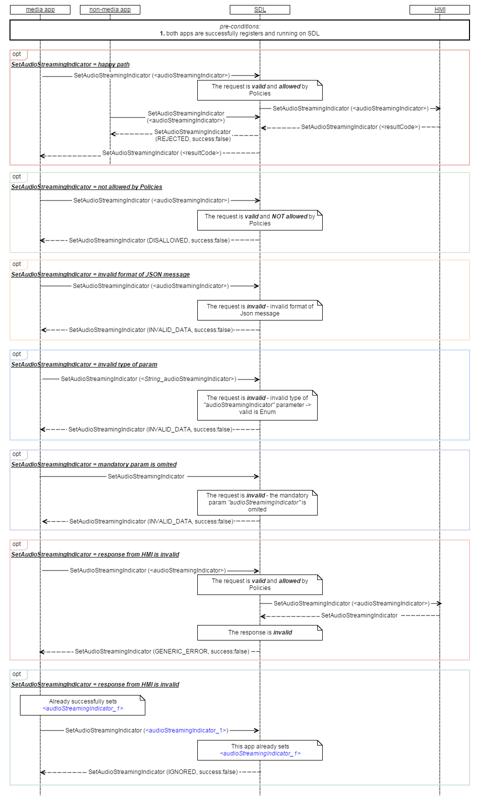

## SetAudioStreamingIndicator

Type
: Function

Sender
: SDL

Purpose
: Set the icon properly to the current audio playback of the application.

### Description

The Play/Pause button of the media application shall be able to show one of the following icons:
   - Play/Pause (currently used icon);   
   - Play (a play only icon);   
   - Pause (a pause only icon).   

The default icon for the Play/Pause button shall be the Play/Pause icon (PLAY_PAUSE).
The default icon must be set to the button, when the media application:
   - is newly registered on the head unit (after _RegisterAppInterface_).
   - was closed by the user (Application enters HMI_NONE)."
   
The request may arrive in both cases when the application is active or in background on HMI (depends on Policy Table permissions applicable to mobile application request, by default allowed to operate in all HMI levels except of NONE).

!!! NOTE   
Due to _SetAudioStreamingIndicator_ is disallowed by User, HMI must be able to direct user to the mobile applications settings menu to change app permissions (ONLY for EXTERNAL_PROPRIETARY Policy flag ON). 
!!!

### Request
#### Behavior

The icon of the Play/Pause button shall be modifiable by the media application by sending a RPC Request is called _SetAudioStreamingIndicator_.

!!! NOTE    
_SDL must transfer:_   

   - _SetAudioStreamingIndicator_request from mobile application to HMI in case no any failures;_   
   - _HMI's response (`<resultCode>`) to mobile application._ 
!!!

#### Parameters

|Name|Type|Mandatory|
|:---|:---|:--------|
|audioStreamingIndicator|[Common.AudioStreamingIndicator](../../common/enums/audiostreamingindicator)|true|


### Response

_SetAudioStreamingIndicator_Response_ must return:   
    - SUCCESS when the Play/Pause button is set to the desired icon;   
    - IGNORED when the Play/Pause button was already set to the desired icon;   
    - DISALLOWED when the RPC is used in an invalid HMI level;    
    - and other applicable resultCodes.   
    
!!! NOTE
In case HMI does NOT respond during `<DefaultTimeout>`, SDL must respond "GENERIC_ERROR, success:false" to mobile application.
!!!

#### Parameters

This RPC has no additional parameter requirements.

### Sequence Diagrams

|||
SetAudioStreamingIndicator for active application with AudioStreamingIndicator param.   

|||

### Example Request

```
{
  "id": 29,
  "jsonrpc":"2.0",
  "method" : “UI.SetAudioStreamingIndicator",
  "params":{ "audioStreamingIndicator" : "PLAY"}
}

```

### Example Response
```
{
  "id":29,
  "jsonrpc":"2.0", 
  "result":{"method":" UI.SetAudioStreamingIndicator ",
  "code":0}
}
```
