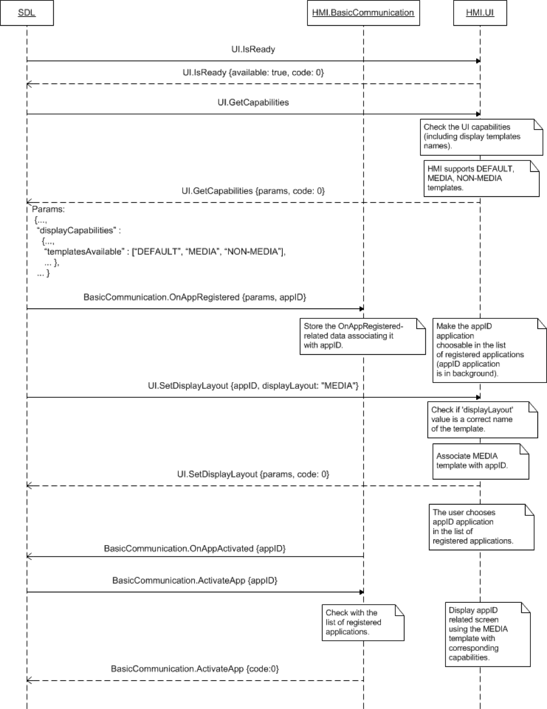
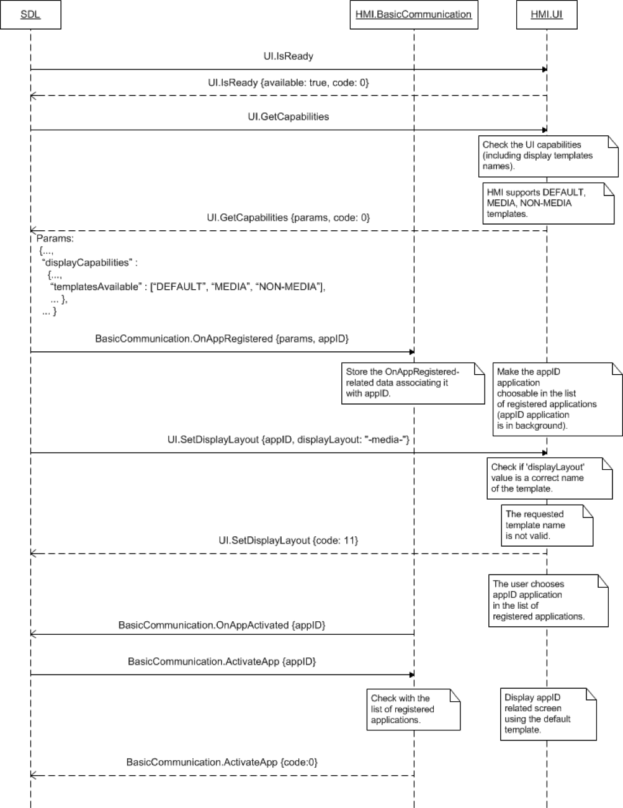

## SetDisplayLayout

Type
: Function

Sender
: SDL

Purpose
: Set the display template for the specified application's persistent display.

!!! NOTE
This RPC is no longer used as of SDL version 8.1.0. 

SDL now transforms incoming `SetDisplayLayout` requests from mobile into [UI.Show](../Show) requests with the `templateConfiguration` parameter to change the display layout.
!!!
### Request

!!! must

1. The HMI must send a `BC.OnResetTimeout` notification to SDL to reset the timeout in case it needs more time to process the request.

!!!

#### Parameters

|Name|Type|Mandatory|Additional|
|:---|:---|:--------|:---------|
|displayLayout|String|true|maxlength: 500|
|appID|Integer|true||
|dayColorScheme|[Common.TemplateColorScheme](../../common/structs/#templatecolorscheme)|false||
|nightColorScheme|[Common.TemplateColorScheme](../../common/structs/#templatecolorscheme)|false||

### Response

#### Parameters

|Name|Type|Mandatory|Additional|
|:---|:---|:--------|:---------|
|displayCapabilities|[Common.DisplayCapabilities](../../common/structs/#displaycapabilities)|false||
|buttonCapabilities|[Common.ButtonCapabilities](../../common/structs/#buttoncapabilities)|false|array: true<br>minsize: 1<br>maxsize: 100|
|softButtonCapabilities|[Common.SoftButtonCapabilities](../../common/structs/#softbuttoncapabilities)|false|array: true<br>minsize: 1<br>maxsize: 100|
|presetBankCapabilities|[Common.PresetBankCapabilities](../../common/structs/#presetbankcapabilities)|false||

### Sequence Diagrams

|||
SetDisplayLayout Successful with UI.GetCapabilities

|||

|||
SetDisplayLayout Invalid Data with UI.GetCapabilities

|||

### JSON Message Examples

#### Example Request

```json
{
  "id" : 47,
  "jsonrpc" : "2.0",
  "method" : "UI.SetDisplayLayout",
  "params" :
  {
    "displayLayout" : "NON-MEDIA",
    "appID" : 65638
  }
}
```

#### Example Response

```json
{
    "jsonrpc":"2.0",
    "id":42,
    "result":{
        "code":0,
        "method":"UI.SetDisplayLayout",
        "displayCapabilities":{
            "displayType":"GEN2_8_DMA",
            "displayName":"SDL_HMI",
            "textFields":[
                {
                    "name":"mainField1",
                    "characterSet":"UTF_8",
                    "width":500,
                    "rows":1
                },
                ...
                {
                    "name":"mediaClock",
                    "characterSet":"UTF_8",
                    "width":500,
                    "rows":1
                },
                {
                    "name":"mediaTrack",
                    "characterSet":"UTF_8",
                    "width":500,
                    "rows":1
                },
                {
                    "name":"templateTitle",
                    "characterSet":"UTF_8",
                    "width":100,
                    "rows":1
                },
                {
                    "name":"alertText1",
                    "characterSet":"UTF_8",
                    "width":500,
                    "rows":1
                },
                ...
            ],
            "imageFields":[
                {
                    "name":"softButtonImage",
                    "imageTypeSupported":[
                        "GRAPHIC_BMP",
                        "GRAPHIC_JPEG",
                        "GRAPHIC_PNG"
                    ],
                    "imageResolution":{
                        "resolutionWidth":64,
                        "resolutionHeight":64
                    }
                },
                {
                    "name":"choiceImage",
                    "imageTypeSupported":[
                        "GRAPHIC_BMP",
                        "GRAPHIC_JPEG",
                        "GRAPHIC_PNG"
                    ],
                    "imageResolution":{
                        "resolutionWidth":64,
                        "resolutionHeight":64
                    }
                },
                ...
            ],
            "mediaClockFormats":[
                "CLOCK1",
                "CLOCK2",
                "CLOCK3",
                "CLOCKTEXT1",
                "CLOCKTEXT2",
                "CLOCKTEXT3",
                "CLOCKTEXT4"
            ],
            "graphicSupported":true,
            "imageCapabilities":[
                "DYNAMIC",
                "STATIC"
            ],
            "templatesAvailable":[
                "MEDIA",
                "NON-MEDIA",
                "NAV_FULLSCREEN_MAP",
                "WEB_VIEW"
            ],
            "screenParams":{
                "resolution":{
                    "resolutionWidth":800,
                    "resolutionHeight":480
                },
                "touchEventAvailable":{
                    "pressAvailable":true,
                    "multiTouchAvailable":true,
                    "doublePressAvailable":false
                }
            },
            "numCustomPresetsAvailable":8
        },
        "buttonCapabilities":[
            ...
            {
                "name":"OK",
                "shortPressAvailable":true,
                "longPressAvailable":true,
                "upDownAvailable":true
            },
            {
                "name":"SEEKLEFT",
                "shortPressAvailable":true,
                "longPressAvailable":true,
                "upDownAvailable":true
            },
            {
                "name":"SEEKRIGHT",
                "shortPressAvailable":true,
                "longPressAvailable":true,
                "upDownAvailable":true
            },
            {
                "name":"TUNEUP",
                "shortPressAvailable":true,
                "longPressAvailable":true,
                "upDownAvailable":true
            },
            {
                "name":"TUNEDOWN",
                "shortPressAvailable":true,
                "longPressAvailable":true,
                "upDownAvailable":true
            }
        ],
        "softButtonCapabilities":[
            {
                "shortPressAvailable":true,
                "longPressAvailable":true,
                "upDownAvailable":true,
                "imageSupported":true
            }
        ],
        "presetBankCapabilities":{
            "onScreenPresetsAvailable":true
        }
    }
}
```

#### Example Error

```json
{
  "id" : 47,
  "jsonrpc" : "2.0",
  "error" :
  {
    "code" : 6,
    "message" : "Ignored as the requested template is already associated with the named appID",
    "data" :
    {
      "method" : "UI.SetDisplayLayout"
    }
  }
}
```
