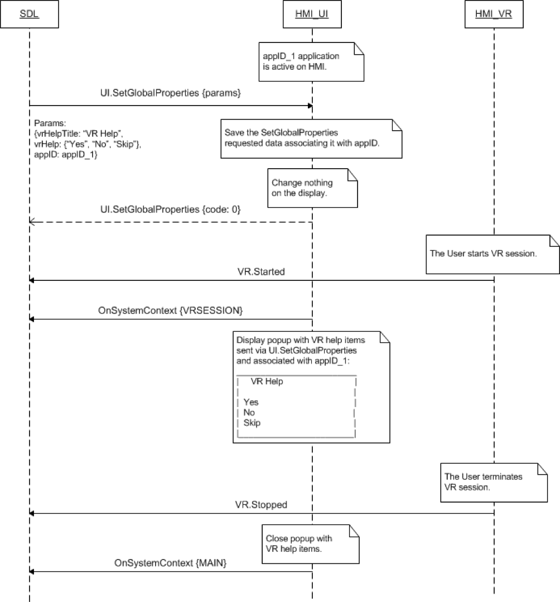

## SetGlobalProperties

Type
: Function

Sender
: SDL

Purpose
: Set the UI properties of an application.

### Description
SDL requests to set-up the data for VR help layout, the name and icon for in-application menu and the properties of the touchscreen keyboard.

The request may arrive for the application whatever being active or in background on HMI (depends on Policy Table permissions applicable to mobile application request, by default allowed to operate in all HMI levels except of NONE).

SDL sends _SetGlobalProperties_request_ with specific _vrHelp_ and _vrHelpTitle_ values to HMI in next cases:   

1.	In case mobile app sends the very first _SetGlobalProperties_request_ in current ignition cycle
with `<VRHelp>` and `<VRHelpTitle>` params, SDL transfers `<VRHelp>` and `<VRHelpTitle>`.   
2.	In case mobile app sends the very first _SetGlobalProperties_request_ in current ignition cycle
without `<VRHelp>` and `<VRHelpTitle>` params, SDL generates default values of `<VRHelp>` and `<VRHelpTitle>` and transfers them.   
3.	In case mobile app sends the next (not first) _SetGlobalProperties_request_ within the same ignition cycle with `<VRHelp>` and `<VRHelpTitle>` params, SDL transfers them.   
4.	In case mobile app the next (not first) _SetGlobalProperties_request_ within the same ignition cycle without `<VRHelp>` and `<VRHelpTitle>` params, SDL omits (not sends) `<VRHelp>` and `<VRHelpTitle>` to HMI.   
5.	In case SDL resumes `<VRHelp>` and `<VRHelpTitle>` during Data resumption, SDL must not send default values of VR at the nexts (not first) _SetGlobalProperties_ requests.   
6. In case mobile app sends _SetGlobalProperties_request_ to SDL:   
    - with both valid values of _autoCompleteList_ and _autoCompleteText_ params, _SDL must_:   
        - transfer _SetGlobalProperties_request_ with _autoCompleteList_ param and without (omitted) _autoCompleteText_ param to HMI;   
        - respond with `<resultCode_received_from_HMI>` to mobile app.   
    - with valid _autoCompleteList_ parameter with other valid params related to request and this request is allowed by Policies, _SDL must_:   
        - transfer _SetGlobalProperties_ with all requested params to HMI;   
        - respond with `<resultCode_received_from_HMI>` to mobile app.   
    - without _autoCompleteList_ parameter with other valid params related to request and this request is allowed by Policies, _SDL must_:   
        - transfer _SetGlobalProperties_ with all requested parameters to HMI (_thus, without autoCompleteList_).   
        - respond with `<resultCode_received_from _HMI>` to mobile app.   
 
!!! NOTE

Default values of vrHelpItems are set to all the 1st VR commands of the current application and app's VR synonym. By default vrHelpTitle value is set to application name.
_**Notes for HMI expected behavior:**_

1. The system shall have the ability to receive and store multiple strings for _autoCompleteText_ per app.   
2. When the system receives a new list of strings for autoCompleteText for a particular app, the system shall delete the previous list and replace it with the new list for that app.   
3. When any of the keyboard layouts are being used, the system shall reference the list of _autoCompleteText_ strings for that app.   
4. As the user enters data on the keyboard, the system shall display the _autoCompleteText_ strings which match the entry.   
5. The number of matching _autoCompleteText_ strings displayed shall only be limited by the character length constraints of the hmi.   
6. The system shall provide the user the ability to select one of the displayed matching _autoCompleteText_ strings without having to enter the entire string.   
7. When the user selects one of the displayed matching _autoCompleteText_ string, the system shall submit that entry and not require further user input for submission.

!!!

### Request
#### Behavior

!!! MUST   

1. Store the information and associate it with appID.
    * Note: _Initially, the appID together with other application-related information is provided by SDL within UpdateAppList or OnAppRegistered RPCs._
2. Whenever the User activates VR, set up the requested values for VR help layout, the name and icon for in-application menu and the properties of the touchscreen keyboard (if supported):
    * display the list of commands available for voice recognition. SDL provides the title for this list (_vrHelpTitle_ parameter) and the list of commands itself (vrHelp parameter which is an array of VrHelpItem‘s).   
    * display the in-application menu for every active application on User’s request. It must contain SDL-requested commands (UI.AddCommand) and sub menus (UI.AddSubMenu). SDL provides the values for the name (_menuTitle_ parameter) and for the icon (menuIcon parameter) of this in-application menu. The values for in-application menu and touchscreen keyboard are allowed by SDL for navigation type of application only.   
    * display the onscreen keyboard upon User\`s request within the following condition: all keyboardProperties supported by HMI must be embodied in HMI_capabilities.json file. In this case SDL are able to compare keyboardProperties requested by mobile device with actual supported keyboardProperties and send to HMI only that are supported.    
    * use default keyboardProperties – parameter in case SDL transfers UI.SetGlobalProperties request with omitted or empty keyboardProperties param to HMI.   
    * _**Important Note:**_ _If HMI-defined VR commands are accessible together with those provided by SDL via VR.AddCommand, HMI must:_ 
        * _add the corresponding VR HMI-defined commands to the list of VR help items provided by SDL via UI.SetGlobalProperties_
        * _display the complete list of available VR commands (SDL-defined and HMI-defined ones) when the User activates VR._
3. Respond to the request.   

!!!

#### Parameters

|Name|Type|Mandatory|Additional|
|:---|:---|:--------|:---------|
|vrHelpTitle|String|false|maxlength: 500|
|vrHelp|[Common.VrHelpItem](../../common/structs/#vrhelpitem)|false|array: true<br>minsize: 1<br>maxsize: 100|
|menuTitle|String|false|maxlength: 500|
|menuIcon|[Common.Image](../../common/structs/#image)|false|-|
|keyboardProperties|[Common.KeyboardProperties](../../common/structs/#keyboardproperties)|false|-|
|appID|Integer|true|-|

### Response
|Result |Description |Message type WebSocket|Message type D-Bus|Message Params|
|:------|:-----------|:---------------------|:-----------------|:-------------|
|Success|SUCCESS: HMI has set the requested properties.|JSON response|Method return|code: 0|
|Failure|INVALID_ID:appID is not valid (e.g.does not exist)|JSON response|Method return|code: 13|
|Failure|INVALID_DATA: The data sent is invalid (invalid JSON syntax or parameters out of bounds or of wrong type)|JSON response|Method return|code: 11|
|Failure|GENERIC_ERROR: The unknown issue occurred or other codes are not applicable.|JSON response|Method return|code: 22|

!!! NOTE
In case HMI does not respond SDL's request during SDL-default timeout (10 sec), SDL will return GENERIC_ERROR  result code to the corresponding mobile app's request. Please see [Result Enumeration] for all SDL-supported codes.
!!!

[Result Enumeration]: ../../common/enums/#result

#### Parameters

This RPC has no additional parameter requirements

### Sequence Diagrams
|||
SetGlobalProperties for active app on HMI with VR activation

|||

### Example Request

```json
{
  "id" : 116,
  "jsonrpc" : "2.0",
  "method" : "UI.SetGlobalProperties",
  "params" :
  {
    "vrHelpTitle" : "Choose the action",
    "vrHelp" :
    [
        {
         "text" : "Pause",
         "image" :
          [
             "value" : "tmp/SDL/app/Pandora/icon_1067.jpg",
             "imageType" : DYNAMIC
          ],
         "position" : 1
        },
        {
         "text" : "Resume",
         "image" :
          [
             "value" : "tmp/SDL/app/Pandora/icon_1083.jpeg",
             "imageType" : DYNAMIC
          ],
         "position" : 2
        },
        {
         "text" : "Skip",
         "image" :
          [
             "value" : "tmp/SDL/app/Pandora/icon_1013.jpeg",
             "imageType" : DYNAMIC
          ],
         "position" : 3
        },
        {
         "text" : "Bookmark",
         "image" :
          [
             "value" : "tmp/SDL/app/Pandora/icon_1046.jpeg",
             "imageType" : DYNAMIC
          ],
         "position" : 4
        }
    ],
    "appID" : 53880
  }
}
```
### Example Response

```json
{
  "id" : 116,
  "jsonrpc" : "2.0",
  "result" :
  {
    "code" : 0,
    "method" : "UI.SetGlobalProperties"
  }
}
```

### Example Error

```json
{
  "id" : 116,
  "jsonrpc" : "2.0",
  "error" :
  {
    "code" : 11,
    "message" : "Invalid data",
    "data" :
    {
      "method" : "UI.SetGlobalProperties"
    }
  }
}
```
