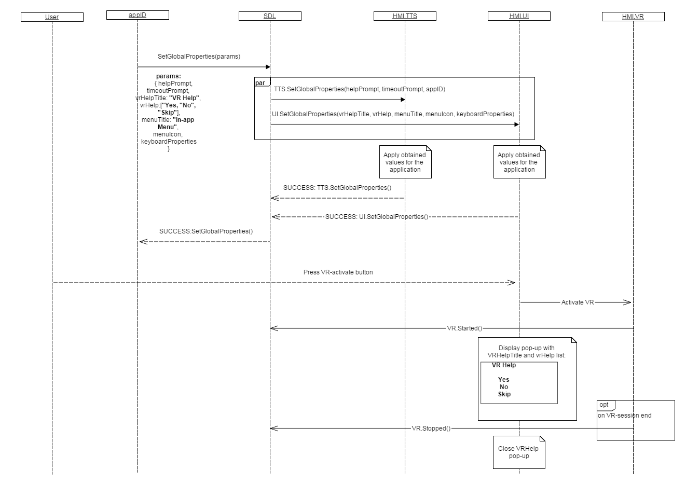
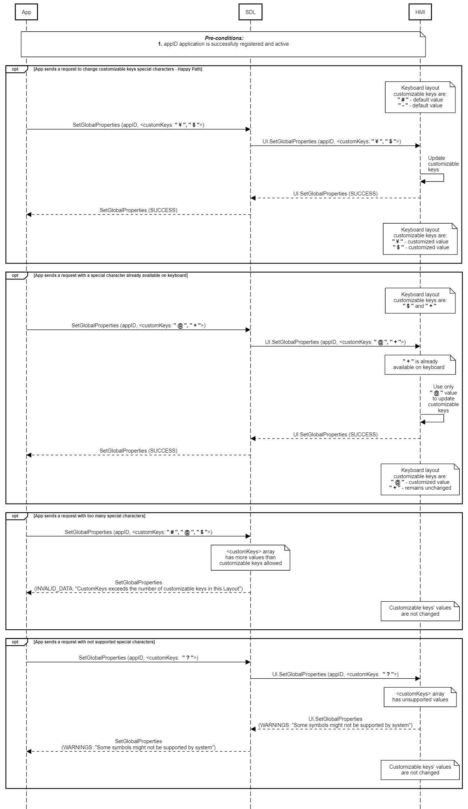
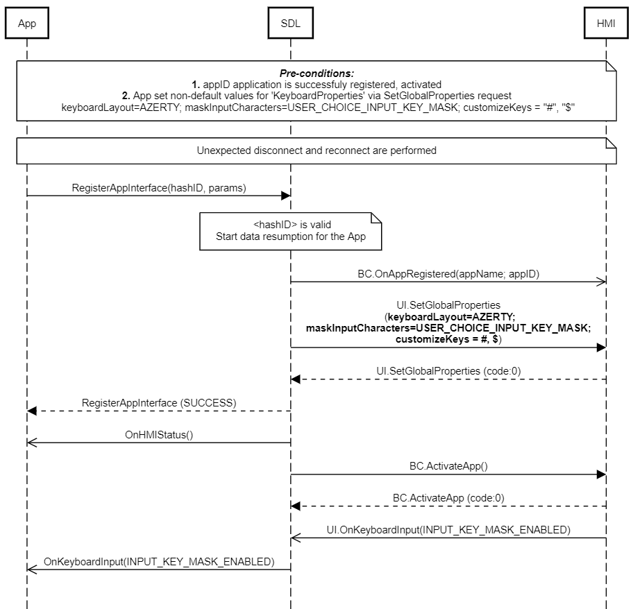

## SetGlobalProperties

Type
: Function

Sender
: SDL

Purpose
: Set the UI properties of an application.

### Description

SDL requests to set-up the data for <abbr title="Voice Recognition">VR</abbr> help layout, the name and icon for in-application menu and the properties of the touchscreen keyboard (such as providing custom special characters to display at the root level of the keyboard layout).

### Request

The request may arrive for the application whether being active or in background on HMI (depends on the Policy Table permissions applicable to mobile application request, by default allowed to operate in all HMI levels except `NONE`).

The `vrHelp` parameter of the `SetGlobalProperties` RPC is used by the system to display the help items on the screen, and the `helpPrompt` parameter is used by the system for playing out the associated <abbr title="Text To Speech">TTS</abbr> help prompt.

SDL Core sends `SetGlobalProperties` request with specific `vrHelp` and `vrHelpTitle` values to HMI in the following cases:   

1. If at any point in time, the application sends `SetGlobalProperties` RPC with the `vrHelp` **and** `helpPrompt` parameters, then SDL Core shall continue with the existing behavior of forwarding such requests to HMI and SDL Core shall delete its internal list and stop sending `SetGlobalProperties` RPC to HMI after each `AddCommand`/`DeleteCommand` request received from mobile.
2. If at any point in time, the application sends `SetGlobalProperties` RPC with **either** of `vrHelp` **or** `helpPrompt` parameters, then SDL Core shall continue with the existing behavior of forwarding such requests to HMI and SDL Core shall not delete its internal list and shall continue to update the parameter which was not provided by the application.  
3. In case mobile application sends `AddCommand` with `CommandType = Command`, SDL Core must send updated values of `vrHelp` via `SetGlobalProperties` to HMI. _(Note: `AddCommand` requests related to choice set must NOT trigger the update of `vrHelp`)_
4. In case mobile application sends _SetGlobalProperties request_ to SDL Core:   
    * SDL Core must omit the `autoCompleteText` parameter when forwarding to the HMI
        * if `autoCompleteText` is present and `autoCompleteList` is omitted, SDL Core forwards `autoCompleteList` with a single value, taken from `autoCompleteText`.

!!! MUST

1. Store the information and associate it with `appID`.
    * _Note:_ Initially, the appID together with other application-related information is provided by SDL within UpdateAppList or OnAppRegistered RPCs.
2. When the system receives a new list of strings in `autoCompleteList` for a particular application, the system must delete the previous list and replace it with the new list for that application. 
3. Whenever the User activates <abbr title="Voice Recognition">VR</abbr> or sets up the requested values for <abbr title="Voice Recognition">VR</abbr> help layout, HMI must display the list of commands available for voice recognition. SDL Core provides the title for this list (`vrHelpTitle` parameter) and the list of commands itself (`vrHelp` parameter which is an array of `VrHelpItem`).
    * _**Important Note:**_ If HMI-defined <abbr title="Voice Recognition">VR</abbr> commands are accessible together with those provided by SDL Core via VR.AddCommand, HMI must:
        * add the corresponding <abbr title="Voice Recognition">VR</abbr> HMI-defined commands to the list of <abbr title="Voice Recognition">VR</abbr> help items provided by SDL via UI.SetGlobalProperties
        * display the complete list of available <abbr title="Voice Recognition">VR</abbr> commands (SDL-defined and HMI-defined ones) when the User activates <abbr title="Voice Recognition">VR</abbr>.
4. HMI displays the in-application menu for every active application upon the User's request. It must contain SDL-requested commands (UI.AddCommand) and sub-menus (UI.AddSubMenu). SDL provides the values for the name (`menuTitle` parameter) and for the icon (`menuIcon` parameter) of this in-application menu. The values for in-application menu and touchscreen keyboard are allowed by SDL Core for navigation type of application only.
5. In case SDL sends request with some values in `customKeys` array, HMI must:
    * use these values to change the special characters shown in customizable keys
    * keep default values in the remaining keys, if the array is less than or equal to customizable keys amount
6. Depending on the value of `maskInputCharacters`, the HMI must do the following when displaying the keyboard:
    * DISABLE_INPUT_KEY_MASK (default if not set) - Display input characters submitted by the user in the input box normally
    * ENABLE_INPUT_KEY_MASK - Mask input characters submitted by the user in the input box
    * USER_CHOICE_INPUT_KEY_MASK - Mask input characters by default and provide a toggle option for the user to disable masking

_Note: HMI should not duplicate special characters on keyboard._ 
  
!!!

!!! NOTE

By default `vrHelpTitle` value is set to application name.

_**Notes for HMI expected behavior:**_

1. The system shall have the ability to receive and store multiple strings from `autoCompleteList` per application.
2. When any of the keyboard layouts are being used, the system shall reference the `autoCompleteList` strings for that application.
3. As the User enters data on the keyboard, the system shall display values from `autoCompleteList` which match the entry.
4. The number of matching `autoCompleteList` strings displayed shall only be limited by the character length constraints of the HMI.
5. The system shall provide the User with the ability to select one of the displayed matching `autoCompleteList` strings without having to enter the entire string.
6. When the User selects one of the displayed matching `autoCompleteList` strings, the system shall submit that entry and not require further User input for submission.
7. The system shall allow applications to customize the special characters in each keyboard layout depending on the [KeyboardCapabilities](../../common/structs/#keyboardcapabilities) it provides.
8. The system shall allow applications to decide whether or not to mask input characters submitted by the user if this capability is enabled in [KeyboardCapabilities](../../common/structs/#keyboardcapabilities).

!!!

#### Parameters

|Name|Type|Mandatory|Additional|
|:---|:---|:--------|:---------|
|vrHelpTitle|String|false|maxlength: 500|
|vrHelp|[Common.VrHelpItem](../../common/structs/#vrhelpitem)|false|array: true<br>minsize: 1<br>maxsize: 100|
|menuTitle|String|false|maxlength: 500|
|menuIcon|[Common.Image](../../common/structs/#image)|false||
|keyboardProperties|[Common.KeyboardProperties](../../common/structs/#keyboardproperties)|false||
|appID|Integer|true||
|menuLayout|[Common.MenuLayout](../../common/enums/#menulayout)|false||

### Response

!!! NOTE

In case HMI does not respond to SDL Core request during SDL-default timeout (10 sec), SDL Core returns **"GENERIC_ERROR"**  result code to the corresponding mobile application request.

!!!

#### Parameters

This RPC has no additional parameter requirements.

### Sequence Diagrams

|||
SetGlobalProperties for active app on HMI with <abbr title="Voice Recognition">VR</abbr> activation

|||

|||
SetGlobalProperties for active app with TTS.SetGlobalProperties_request, UI.SetGlobalProperties_request, VR.Started, VR.Stopped

|||

|||
SetGlobalProperties Custom Keys

|||

|||
SetGlobalProperties Resumption of non-default KeyboardProperties

|||

### JSON Message Examples

#### Example Request

```json
{
  "id" : 116,
  "jsonrpc" : "2.0",
  "method" : "UI.SetGlobalProperties",
  "params" :
  {
    "vrHelpTitle" : "Choose the action",
    "vrHelp" :
    [
        {
         "text" : "Pause",
         "image" :
          {
             "value" : "tmp/SDL/app/Pandora/icon_1067.jpg",
             "imageType" : "DYNAMIC"
          },
         "position" : 1
        },
        {
         "text" : "Resume",
         "image" :
          {
             "value" : "tmp/SDL/app/Pandora/icon_1083.jpeg",
             "imageType" : "DYNAMIC"
          },
         "position" : 2
        },
        {
         "text" : "Skip",
         "image" :
          {
             "value" : "tmp/SDL/app/Pandora/icon_1013.jpeg",
             "imageType" : "DYNAMIC"
          },
         "position" : 3
        },
        {
         "text" : "Bookmark",
         "image" :
          {
             "value" : "tmp/SDL/app/Pandora/icon_1046.jpeg",
             "imageType" : "DYNAMIC"
          },
         "position" : 4
        }
    ],
    "appID" : 53880
  }
}
```

#### Example Response

```json
{
  "id" : 116,
  "jsonrpc" : "2.0",
  "result" :
  {
    "code" : 0,
    "method" : "UI.SetGlobalProperties"
  }
}
```

#### Example Error

```json
{
  "id" : 116,
  "jsonrpc" : "2.0",
  "error" :
  {
    "code" : 11,
    "message" : "Invalid data",
    "data" :
    {
      "method" : "UI.SetGlobalProperties"
    }
  }
}
```
