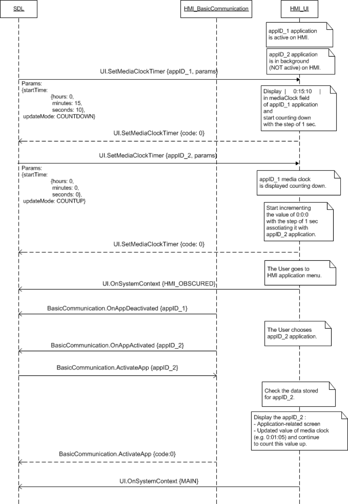
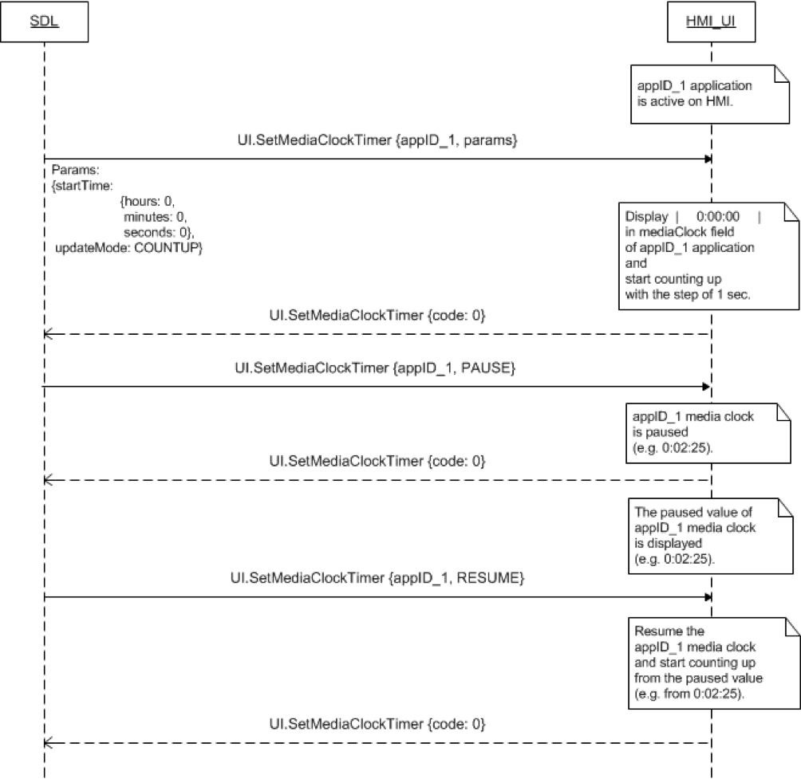
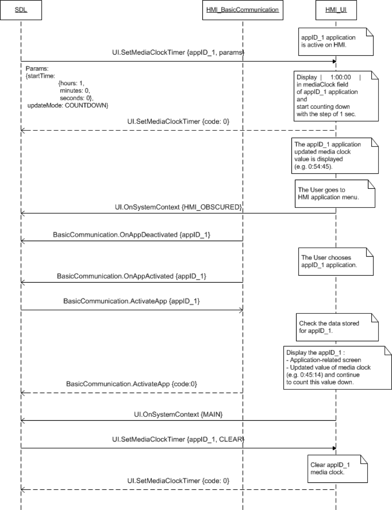

## SetMediaClockTimer

Type
: Function

Sender
: SDL

Purpose
: Set a value and update mode for the media clock of a media application.

### Request

#### Parameters

|Name|Type|Mandatory|Additional|Description|
|:---|:---|:--------|:---------|:----------|
|startTime|Common.TimeFormat|false|||
|endTime|Common.TimeFormat|false|||
|updateMode|Common.ClockUpdateMode|true|||
|appID|Integer|true|||

#### TimeFormat

|Name|Type|Mandatory|Additional|Description|
|:---|:---|:--------|:---------|:----------|
|hours|Integer|true|minvalue: 0<br>maxvalue: 59||
|minutes|Integer|true|minvalue: 0<br>maxvalue: 59||
|seconds|Integer|true|minvalue: 0<br>maxvalue: 59||

#### TimeFormat

|Name|Type|Mandatory|Additional|Description|
|:---|:---|:--------|:---------|:----------|
|hours|Integer|true|minvalue: 0<br>maxvalue: 59||
|minutes|Integer|true|minvalue: 0<br>maxvalue: 59||
|seconds|Integer|true|minvalue: 0<br>maxvalue: 59||

#### ClockUpdateMode

|Name|Value|
|:---|:----|
|COUNTUP|0|
|COUNTDOWN|1|
|PAUSE|2|
|RESUME|3|
|CLEAR|4|

### Response

#### Parameters

This RPC has no additional parameter requirements

### Sequence Diagrams
|||
SetMediaClockTimer COUNTUP and COUNTDOWN for Full and Background applications

|||
|||
SetMediaClockTimer Pause and Resume for Active Application

|||
|||
SetMediaClockTimer COUNTDOWN for a deactivated application

|||

### Example Request

```json
{
	"id" : 109,
	"jsonrpc" : "2.0",
	"method" : "UI.SetMediaClockTimer",
	"params" :
	{
		"startTime" :
		{
				 "hours" : 0,
				 "minutes" : 18,
				 "seconds" : 17
		},
		"updateMode" : "COUNTUP",
		"appID" : 65146
	}
}
```
### Example Response

```json
{
	"id" : 109,
	"jsonrpc" : "2.0",
	"result" :
	{
		"code" : 0,
		"method" : "UI.SetMediaClockTimer"
	}
}
```

### Example Error

```json
{
	"id" : 109,
	"jsonrpc" : "2.0",
	"error" :
	{
		"code" : 11,
		"message" : "Invalid data",
		"data" :
		{
			"method" : "UI.SetMediaClockTimer"
		}
	}
}
```
