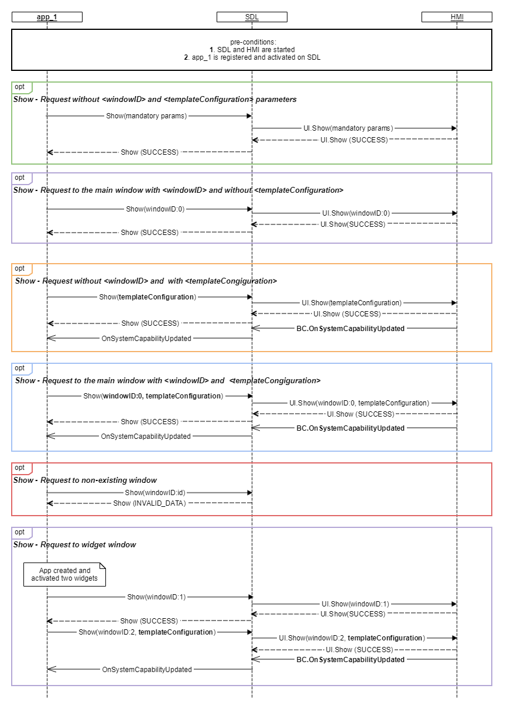
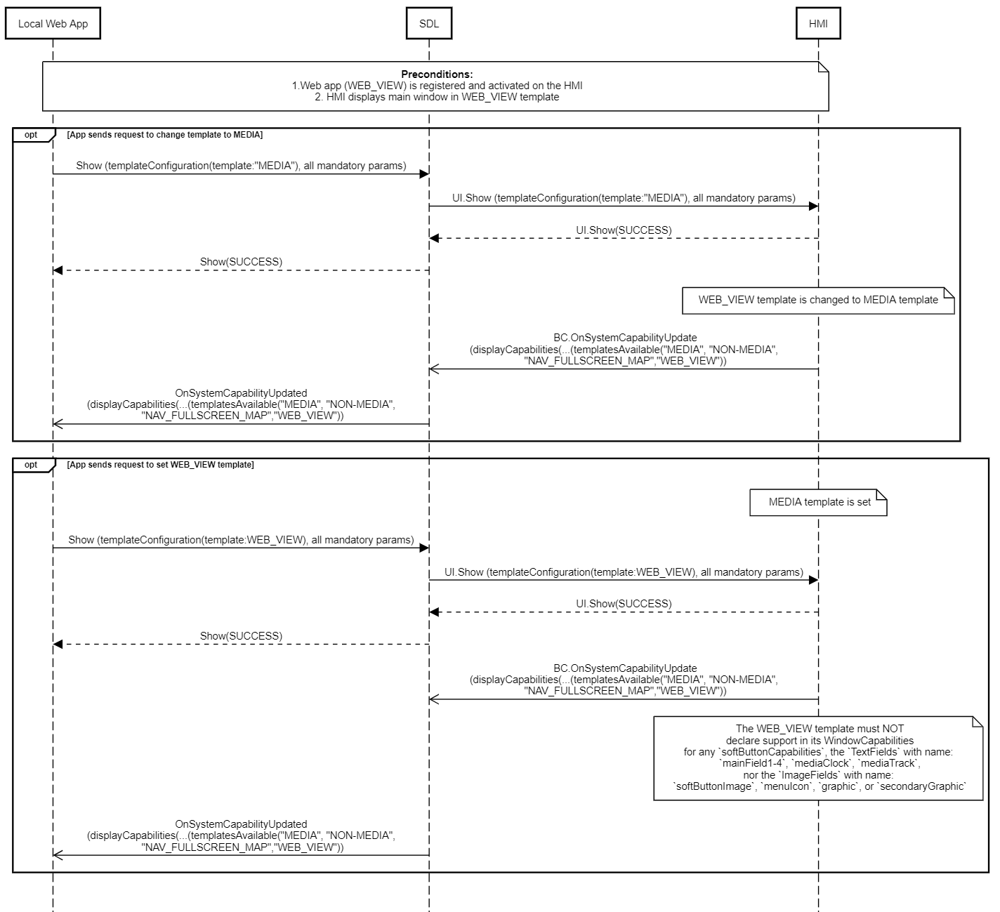

## Show

Type
: Function

Sender
: SDL

Purpose
: Update fields displayed on the HMI for the specified application.

!!! NOTE

For the applications with `WEB_VIEW` template `UI.Show` is not allowed to support:
* textfields
* soft buttons
* graphics

!!!

### Request

#### Parameters

|Name|Type|Mandatory|Additional|
|:---|:---|:--------|:---------|
|showStrings|[Common.TextFieldStruct](../../common/structs/#textfieldstruct)|true|array: true<br>minsize: 0<br>maxsize: 8|
|alignment|[Common.TextAlignment](../../common/enums/#textalignment)|false||
|graphic|[Common.Image](../../common/structs/#image)|false||
|secondaryGraphic|[Common.Image](../../common/structs/#image)|false||
|softButtons|[Common.SoftButton](../../common/structs/#softbutton)|false|array: true<br>minsize: 0<br>maxsize: 8|
|customPresets|String|false|array: true<br>minsize: 0<br>maxsize: 10<br>maxlength: 500|
|appID|Integer|true||
|windowID|Integer|false||
|templateConfiguration|[Common.TemplateConfiguration](../../common/structs/#templateconfiguration)|false||

### Response

#### Parameters

This RPC has no additional parameter requirements

### Sequence Diagrams

|||
Active App shows and is deactivated then reactivated

|||

|||
Inactive App Sends Show

|||

|||
Show with Soft Buttons

|||

|||
Show Text Fields

|||

|||
Show Widgets

|||

|||
Show request to set/change template WEB_VIEW

|||

### JSON Message Examples

#### Example Request

```json
{
  "id" : 120,
  "jsonrpc" : "2.0",
  "method" : "UI.Show",
  "params" :
  {
    "showStrings" :
    [
      {
         "fieldName" : "mainField1",
         "fieldText" : "Favourite Album"
      },
      {
         "fieldName" : "mediaClock",
         "fieldText" : "1:45:12"
      },
      {
         "fieldName" : "mediaTrack",
         "fieldText" : "Ironic – The Collection – Alanis Morissette"
      }
    ],
    "alignment" : "LEFT_ALIGNED",
    "graphic" :
    {
         "value" : "tmp/SDL/app/Best_Media/AM-Collection-cover.png",
         "imageType" : "DYNAMIC"
    },
    "softButtons" :
    [
      {
      "type" :  "BOTH",
      "text" : "Change Album",
      "image" :
       {
         "value" : "tmp/SDL/app/Best_Media/change_alb_icon.jpg",
         "imageType" : "DYNAMIC"
       },
      "softButtonID" : 48,
      "systemAction" : "DEFAULT_ACTION"
      },

      {
      "type" :  "TEXT",
      "text" : "Change Artist",
      "softButtonID" : 57
      }
    ],
    "customPresets" : ["Like Song", "Like Album"],
    "appID" : 8726
  }
}
```

#### Example Response

```json
{
  "id" : 120,
  "jsonrpc" : "2.0",
  "result" :
  {
    "code" : 0,
    "method" : "UI.Show"
  }
}
```

#### Example Error

```json
{
  "id" : 120,
  "jsonrpc" : "2.0",
  "error" :
  {
    "code" : 22,
    "message" : "An unknown issue occurred ",
    "data" :
    {
      "method" : "UI.Show"
    }
  }
}
```
